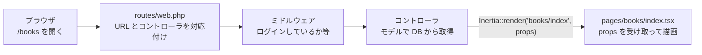
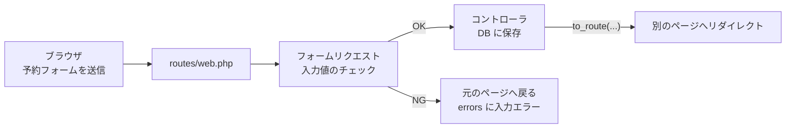
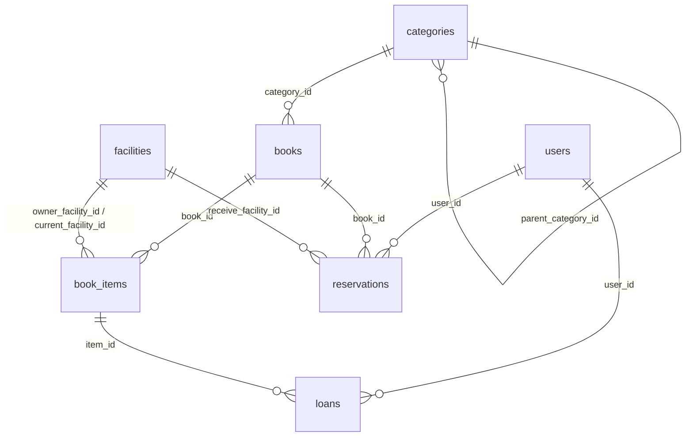

# バックエンド開発ガイド

このプロジェクトでサーバー側（Laravel）を作るためのガイドです。

## 目次

- [はじめに](#はじめに)
- [このアプリの仕組み](#このアプリの仕組み)
- [チュートリアル](#チュートリアル)
    - [ステップ 1 モデルとマイグレーションを作る](#ステップ-1-モデルとマイグレーションを作る)
    - [ステップ 2 テーブルを定義する](#ステップ-2-テーブルを定義する)
    - [ステップ 3 モデルを書く](#ステップ-3-モデルを書く)
    - [ステップ 4 ダミーデータを入れる](#ステップ-4-ダミーデータを入れる)
    - [ステップ 5 コントローラを作り仮ルートを置き換える](#ステップ-5-コントローラを作り仮ルートを置き換える)
    - [ステップ 6 テストを書く](#ステップ-6-テストを書く)
- [Laravel の基本](#laravel-の基本)
- [Eloquent とリレーション](#eloquent-とリレーション)
- [バリデーションとフォーム送信](#バリデーションとフォーム送信)
- [認証と認可](#認証と認可)
- [テストとチェック](#テストとチェック)
- [フロントエンドとの連携](#フロントエンドとの連携)
- [よくあるつまずき](#よくあるつまずき)
- [用語集](#用語集)
- [参考リンク](#参考リンク)

## はじめに

このガイドを読み終えると、次のことができるようになります。

- テーブルを作り、モデルからデータを読み書きする
- コントローラからページに props を渡す
- フォームの送信を受け取り、入力値をチェックして保存する
- 「ログインしている人だけ」「職員だけ」「自分の予約だけ」のような制限をかける

**前提** — [開発環境セットアップ](dev-setup.md)が終わっていること。PHP の文法（クラス、配列、`->` と `::`）は知っている前提で、Laravel の仕組みから説明します。

**読み方** — まず「[このアプリの仕組み](#このアプリの仕組み)」を読んでから、「[チュートリアル](#チュートリアル)」で実際に本の一覧ページのサーバー側を作ってみてください。
それ以降の章は、必要になったときに辞書のように引けば十分です。

画面側のことは[フロントエンド開発ガイド](frontend-guide.md)にまとめています。このガイドの例は、フロントエンド開発ガイドと同じ「本の一覧」「予約フォーム」を裏側から作るものです。

> [!NOTE]
>
> このガイドのコマンドは、すべてコンテナ内で実行する前提で書いています。
> ホスト（Mac）から実行する場合は、`php artisan` を `sail artisan` に、`composer` を `sail composer` に読み替えてください。
> 詳しくは dev-setup の[アプリを操作する](dev-setup.md#アプリを操作する)を参照してください。

## このアプリの仕組み

### API は作らない

このプロジェクトは、Laravel と React を [Inertia](https://inertiajs.com/) でつないだ構成です。
React の画面がよくある「JSON の API を叩いてデータを取る」作りではないため、**バックエンドも JSON の API は作りません**。

| やりたいこと           | 一般的な API サーバー                          | このプロジェクト                                                      |
| ---------------------- | ---------------------------------------------- | --------------------------------------------------------------------- |
| 画面にデータを渡す     | `GET /api/books` で JSON を返す                | `Inertia::render('books/index', [...])` で**ページ名と props** を返す |
| フォームを受け取る     | `POST /api/...` で JSON を受け取り JSON で返す | 普通のフォーム送信として受け取り、**リダイレクト**を返す              |
| 入力エラーを返す       | 422 と JSON のエラーを自分で返す               | バリデーションに失敗すると、Laravel が自動で元のページへ戻す          |
| 「保存しました」の通知 | レスポンスに含めてフロントで表示               | `Inertia::flash('toast', ...)` を書くだけ                             |
| ログイン               | トークンを発行する                             | セッション（Cookie）。Fortify が用意済み                              |

`routes/api.php` も、API 用のコントローラも作りません。Notion の「API」ページに書かれているパスは、**画面とフォームの送信先**のことだと読み替えてください。

### リクエストから画面が出るまで

ブラウザで `/books` を開いたとき、次の順に処理が進みます。



フォームを送信したときは、最後が少し違います。



### 役割分担

| やること                                                 | 担当                     |
| -------------------------------------------------------- | ------------------------ |
| 画面（React コンポーネント）を作る                       | フロントエンド           |
| 画面を先に作るための**仮ルート**（`Route::inertia`）     | フロントエンド           |
| 本物のルート・コントローラ・データベース・バリデーション | バックエンド             |
| ページに渡す props の**名前と形**を決める                | **両方で相談して決める** |

## チュートリアル

フロントエンド開発ガイドの[チュートリアル](frontend-guide.md#チュートリアル)では、ダミーデータを渡す**仮ルート**で「本の一覧」ページを作りました。
ここでは、その仮ルートを本物のデータベースとコントローラに置き換えます。

ページが受け取る props は次の形です。**この形を変えなければ、フロント側のコードは 1 行も変えずに済みます。**

```ts
type Book = {
    id: number;
    title: string;
    author: string;
    category: {
        id: number;
        category_name: string;
    };
};

type Props = {
    books: Book[];
};
```

### ステップ 1 モデルとマイグレーションを作る

本（`books`）は分類（`categories`）に属するので、両方を作ります。

```bash
php artisan make:model Category -mf
php artisan make:model Book -mfs
```

| オプション | 一緒に作るもの                                       | 作られる場所                                      |
| ---------- | ---------------------------------------------------- | ------------------------------------------------- |
| （なし）   | **モデル**（テーブルを PHP から扱うためのクラス）    | `app/Models/Book.php`                             |
| `-m`       | **マイグレーション**（テーブルを作る手順書）         | `database/migrations/日時_create_books_table.php` |
| `-f`       | **ファクトリ**（テスト用のダミーデータの作り方）     | `database/factories/BookFactory.php`              |
| `-s`       | **シーダー**（開発用の初期データを入れるプログラム） | `database/seeders/BookSeeder.php`                 |

モデル名は**単数形の PascalCase**（`Book`）、テーブル名は自動で**複数形の snake_case**（`books`）になります。

### ステップ 2 テーブルを定義する

**編集するファイル：** `database/migrations/日時_create_categories_table.php` と `日時_create_books_table.php`

生成されたファイルの `up()` の中に列を書き足します。`categories` の方から書きます。

```php
public function up(): void
{
    Schema::create('categories', function (Blueprint $table) {
        $table->id();
        $table->foreignId('parent_category_id')->nullable()->constrained('categories');
        $table->string('category_name');
        $table->timestamps();
    });
}
```

```php
public function up(): void
{
    Schema::create('books', function (Blueprint $table) {
        $table->id();
        $table->foreignId('category_id')->constrained();
        $table->string('title');
        $table->text('image_url')->nullable();
        $table->string('material_type');
        $table->string('author');
        $table->string('publisher');
        $table->string('isbn', 13)->nullable();
        $table->timestamps();
    });
}
```

| 書き方                                            | 意味                                                                                        |
| ------------------------------------------------- | ------------------------------------------------------------------------------------------- |
| `$table->id()`                                    | 主キー `id`（自動で 1, 2, 3… と増える整数）                                                 |
| `$table->string('title')`                         | 文字列（VARCHAR(255)）。`text` は長い文字列                                                 |
| `->nullable()`                                    | 空（NULL）を許す。付けなければ必須                                                          |
| `$table->foreignId('category_id')->constrained()` | 外部キー。列名 `category_id` から、参照先が `categories` テーブルの `id` だと自動で判断する |
| `->constrained('categories')`                     | 列名から参照先を判断できないときは、テーブル名を指定する                                    |
| `$table->timestamps()`                            | `created_at` と `updated_at`。保存時に Laravel が自動で入れる                               |

> [!NOTE]
>
> Notion の ER 図では主キーが `book_id` `category_id` のように書かれていますが、このプロジェクトでは Laravel の決まりに合わせて**主キーはすべて `id`** にします。
> 他のテーブルから参照する外部キーは、ER 図どおり `book_id` `category_id` です。

書き終えたら、データベースに反映します。

```bash
php artisan migrate
```

**確認：** `php artisan db:table books` で、書いた列が並んでいれば成功です。

> [!WARNING]
>
> 一度 `main` にマージされたマイグレーションは**編集しないでください**。他の人の環境では実行済みなので、編集しても反映されません。
> 列を足したいときは、新しいマイグレーションを作ります（→ [既存のテーブルに列を足す](#既存のテーブルに列を足す)）。
> まだ自分の手元にしかないマイグレーションなら、`php artisan migrate:rollback` で戻してから編集して構いません。

### ステップ 3 モデルを書く

**編集するファイル：** `app/Models/Category.php` と `app/Models/Book.php`

生成直後のモデルは中身が空です。既存の `app/Models/User.php` に合わせて、次の 3 つを書き足します。

```php
<?php

namespace App\Models;

use Database\Factories\BookFactory;
use Illuminate\Database\Eloquent\Attributes\Fillable;
use Illuminate\Database\Eloquent\Factories\HasFactory;
use Illuminate\Database\Eloquent\Model;
use Illuminate\Database\Eloquent\Relations\BelongsTo;

/**
 * @property int $id
 * @property int $category_id
 * @property string $title
 * @property string|null $image_url
 * @property string $material_type
 * @property string $author
 * @property string $publisher
 * @property string|null $isbn
 */
#[Fillable(['category_id', 'title', 'image_url', 'material_type', 'author', 'publisher', 'isbn'])]
class Book extends Model
{
    /** @use HasFactory<BookFactory> */
    use HasFactory;

    /**
     * @return BelongsTo<Category, $this>
     */
    public function category(): BelongsTo
    {
        return $this->belongsTo(Category::class);
    }
}
```

| 部分                    | 意味                                                                                                                                                                             |
| ----------------------- | -------------------------------------------------------------------------------------------------------------------------------------------------------------------------------- |
| `@property`             | 「このモデルにはこの列がある」という宣言。無くても動くが、静的解析（Larastan）とエディタの補完のために書く                                                                       |
| `#[Fillable([...])]`    | `Book::create([...])` などでまとめて代入してよい列の一覧。ここに無い列は代入しようとするとエラーになる（→ [よくあるつまずき](#保存するときに-fillable-property-のエラーが出る)） |
| `category(): BelongsTo` | **リレーション**。「本は 1 つの分類に属する」。`$book->category` で分類を取り出せるようになる                                                                                    |

`Category` も同じように、`@property`（`id` `parent_category_id` `category_name`）と `#[Fillable(['parent_category_id', 'category_name'])]` を書きます。
リレーションの書き方は [Eloquent とリレーション](#eloquent-とリレーション)で詳しく説明します。

### ステップ 4 ダミーデータを入れる

**編集するファイル：** `database/factories/CategoryFactory.php`、`database/factories/BookFactory.php`、`database/seeders/BookSeeder.php`、`database/seeders/DatabaseSeeder.php`

まずファクトリに「それっぽい値」の作り方を書きます。`fake()` は [Faker](https://fakerphp.org/) というダミーデータ生成ライブラリです。

```php
// database/factories/CategoryFactory.php
public function definition(): array
{
    return [
        'category_name' => fake()->word(),
    ];
}
```

```php
// database/factories/BookFactory.php
use App\Models\Category;

public function definition(): array
{
    return [
        'category_id' => Category::factory(),   // 分類も一緒に作る
        'title' => fake()->sentence(3),
        'material_type' => 'book',
        'author' => fake()->name(),
        'publisher' => fake()->company(),
        'isbn' => fake()->isbn13(),
    ];
}
```

次に、シーダーで開発用のデータを入れます。

```php
// database/seeders/BookSeeder.php
use App\Models\Book;
use App\Models\Category;

public function run(): void
{
    $novel = Category::factory()->create(['category_name' => '小説']);

    Book::factory()->for($novel)->createMany([
        ['title' => '吾輩は猫である', 'author' => '夏目漱石'],
        ['title' => '羅生門', 'author' => '芥川龍之介'],
        ['title' => '銀河鉄道の夜', 'author' => '宮沢賢治'],
    ]);
}
```

`for($novel)` は「この分類に属する本として作る」という意味です。指定しなかった列（`publisher` など）はファクトリの値が使われます。

最後に、`DatabaseSeeder` から呼び出します。

```php
// database/seeders/DatabaseSeeder.php の run() の最後に追加
$this->call(BookSeeder::class);
```

```bash
php artisan migrate:fresh --seed   # テーブルを全部作り直して、シーダーを実行する
```

> [!CAUTION]
>
> `migrate:fresh` は**手元のデータベースの中身をすべて消します**。開発用のデータしか無いことを確認してから実行してください。

**確認：** `php artisan tinker --execute 'echo App\Models\Book::count();'` で `3` と表示されれば成功です。

### ステップ 5 コントローラを作り仮ルートを置き換える

```bash
php artisan make:controller BookController
```

**編集するファイル：** `app/Http/Controllers/BookController.php`

```php
<?php

namespace App\Http\Controllers;

use App\Models\Book;
use Inertia\Inertia;
use Inertia\Response;

class BookController extends Controller
{
    /**
     * Show the book list page.
     */
    public function index(): Response
    {
        $books = Book::query()
            ->select(['id', 'category_id', 'title', 'author'])
            ->with('category:id,category_name')
            ->orderBy('title')
            ->get();

        return Inertia::render('books/index', [
            'books' => $books,
        ]);
    }
}
```

| 部分                                    | 意味                                                                                         |
| --------------------------------------- | -------------------------------------------------------------------------------------------- |
| `Book::query()`                         | `books` テーブルへの問い合わせ（クエリ）を組み立て始める                                     |
| `->select([...])`                       | 取り出す列を絞る。**ページに渡さない列は取らない**                                           |
| `->with('category:id,category_name')`   | 各本の分類も一緒に取る。`:` の後ろは分類側で取る列（→ [N+1 問題と with()](#n1-問題と-with)） |
| `->orderBy('title')` / `->get()`        | タイトル順に並べて、実際に SQL を実行する                                                    |
| `Inertia::render('books/index', [...])` | `resources/js/pages/books/index.tsx` を表示し、配列を props として渡す                       |

`with()` で分類を取るには、本の側の `category_id` が必要です。`select` に `category_id` を入れ忘れると、`category` が `null` になります。

モデルのコレクションは、そのまま JSON になってフロントに届きます。この例では次の形です。

```json
[
    {
        "id": 1,
        "category_id": 1,
        "title": "吾輩は猫である",
        "author": "夏目漱石",
        "category": { "id": 1, "category_name": "小説" }
    }
]
```

次に、フロント担当が書いた仮ルートを本物に置き換えます。

**編集するファイル：** `routes/web.php`

```php
use App\Http\Controllers\BookController;

Route::middleware(['auth', 'verified'])->group(function () {
    Route::inertia('dashboard', 'dashboard')->name('dashboard');

    // 仮ルート（Route::inertia('books', 'books/index', [...ダミーデータ...])）を削除して、これに置き換える
    Route::get('books', [BookController::class, 'index'])->name('books.index');
});
```

**ルート名（`books.index`）は仮ルートと同じにしてください。** フロントはこの名前から作られた関数（`@/routes/books` の `index()`）でリンクしているため、名前が変わるとリンクが壊れます。

**確認：** `npm run dev` を起動した状態で <http://localhost:8000/books> を開き、シーダーで入れた 3 冊が表示されれば成功です。

### ステップ 6 テストを書く

テストは必須ではありませんが、書いておくと「後で誰かが壊したとき」にすぐ気づけます（→ [テストとチェック](#テストとチェック)）。

```bash
php artisan make:test BookIndexTest --pest
```

**編集するファイル：** `tests/Feature/BookIndexTest.php`

```php
<?php

use App\Models\Book;
use App\Models\User;
use Inertia\Testing\AssertableInertia as Assert;

test('guests are redirected to the login page', function () {
    $this->get(route('books.index'))->assertRedirect(route('login'));
});

test('books are listed with their category', function () {
    $user = User::factory()->create();
    $book = Book::factory()->create(['title' => '羅生門']);

    $this->actingAs($user)
        ->get(route('books.index'))
        ->assertOk()
        ->assertInertia(fn (Assert $page) => $page
            ->component('books/index')
            ->has('books', 1)
            ->where('books.0.title', '羅生門')
            ->where('books.0.category.category_name', $book->category->category_name)
        );
});
```

```bash
php artisan test --compact --filter=BookIndexTest
```

最後に、整形と静的解析を実行してエラーが無いことを確認します（→ [テストとチェック](#テストとチェック)）。

```bash
vendor/bin/pint --dirty
composer types:check
```

## Laravel の基本

### ファイルは `make:` で作る

モデルやコントローラは、手でファイルを作らず `php artisan make:...` で作ります。正しい場所に、正しい形のひな形ができます。

| 作りたいもの             | コマンド                                                        | 作られる場所               |
| ------------------------ | --------------------------------------------------------------- | -------------------------- |
| モデル（＋関連ファイル） | `php artisan make:model Book -mfs`                              | `app/Models/`              |
| マイグレーション         | `php artisan make:migration add_role_to_users_table`            | `database/migrations/`     |
| コントローラ             | `php artisan make:controller BookController`                    | `app/Http/Controllers/`    |
| フォームリクエスト       | `php artisan make:request StoreReservationRequest`              | `app/Http/Requests/`       |
| ポリシー                 | `php artisan make:policy ReservationPolicy --model=Reservation` | `app/Policies/`            |
| enum                     | `php artisan make:enum UserRole --string`                       | `app/Enums/`（→ 下の注意） |
| テスト                   | `php artisan make:test BookIndexTest --pest`                    | `tests/Feature/`           |

使えるオプションは `php artisan make:model --help` のように `--help` で確認できます。

> [!NOTE]
>
> `make:enum` は、`app/Enums/` フォルダーが既にあればそこに、無ければ `app/` の直下に作ります。
> 最初の 1 つだけは `php artisan make:enum Enums/UserRole --string` と書いてください。2 つ目以降に `Enums/` を付けると `app/Enums/Enums/` ができてしまいます。

フォルダーごとの役割は[ディレクトリ構成](directory-structure.md#バックエンド)を見てください。

### ルートを書く

ルートは `routes/web.php` に書きます（アカウント設定まわりだけ `routes/settings.php`）。

```php
use App\Http\Controllers\BookController;
use App\Http\Controllers\ReservationController;

Route::middleware(['auth', 'verified'])->group(function () {
    Route::get('books', [BookController::class, 'index'])->name('books.index');
    Route::get('books/{book}', [BookController::class, 'show'])->name('books.show');

    Route::post('reservations', [ReservationController::class, 'store'])->name('reservations.store');
    Route::delete('reservations/{reservation}', [ReservationController::class, 'destroy'])->name('reservations.destroy');
});
```

| 書き方                                      | 意味                                                                         |
| ------------------------------------------- | ---------------------------------------------------------------------------- |
| `Route::get(URL, [コントローラ, '関数名'])` | GET で開いたらコントローラの関数を呼ぶ。`post` `patch` `put` `delete` も同様 |
| `->name('books.show')`                      | **ルート名**。フロント側のリンクや `route('books.show', $book)` で使う       |
| `Route::middleware([...])->group(...)`      | 中のルートすべてにミドルウェア（ルートの手前で動くチェック）をかける         |
| `{book}`                                    | URL の一部を引数として受け取る（→ 次の節）                                   |

コントローラの関数名は、できるだけ Laravel の決まった名前を使います。Notion の API 設計の「アクション」列もこの名前です。

| 関数名    | HTTP メソッドと URL の例      | 役割                 |
| --------- | ----------------------------- | -------------------- |
| `index`   | `GET /books`                  | 一覧ページ           |
| `show`    | `GET /books/{book}`           | 詳細ページ           |
| `create`  | `GET /reservations/create`    | 作成フォームのページ |
| `store`   | `POST /reservations`          | 作成フォームの送信先 |
| `edit`    | `GET /reservations/{id}/edit` | 編集フォームのページ |
| `update`  | `PATCH /reservations/{id}`    | 編集フォームの送信先 |
| `destroy` | `DELETE /reservations/{id}`   | 削除                 |

> [!IMPORTANT]
>
> フロントでは [Wayfinder](https://github.com/laravel/wayfinder) が、**ルート名とコントローラの関数から TypeScript の関数を自動生成**しています（例：`books.show` → `import { show } from '@/routes/books'`）。
> ルート名やコントローラ名・関数名を変えると、フロントのコードが型エラーになります。変えるときはフロント担当に伝えてください。

### URL のパラメータでモデルを受け取る

ルートに `{book}` と書き、コントローラの引数を `Book $book` にすると、**URL の数字を ID として本を自動で取ってきてくれます**（ルートモデルバインディング）。見つからなければ自動で 404 になります。

```php
// Route::get('books/{book}', [BookController::class, 'show'])
public function show(Book $book): Response
{
    // /books/3 を開くと、$book には id = 3 の本が入っている
}
```

`{book}` と `$book` のように、**ルートの `{}` の中の名前と引数の変数名を一致させる**必要があります。

### 動作確認に使うコマンド

| コマンド                                                        | 用途                                                        |
| --------------------------------------------------------------- | ----------------------------------------------------------- |
| `php artisan route:list --except-vendor`                        | 自分たちが定義したルートの一覧                              |
| `php artisan route:list --path=books`                           | URL に `books` を含むルートだけ                             |
| `php artisan db:table books`                                    | テーブルの列の一覧                                          |
| `php artisan tinker`                                            | PHP を 1 行ずつ試せる対話モード（`exit` で終了）            |
| `php artisan tinker --execute 'echo App\Models\Book::count();'` | 1 行だけ実行する                                            |
| `php artisan pail`                                              | ログをリアルタイムで表示する（`Log::info(...)` の出力など） |

tinker では本物のデータベースを操作します。`delete()` などを試すときは注意してください。

## Eloquent とリレーション

**Eloquent** は、テーブルの 1 行を 1 つの PHP オブジェクトとして扱う仕組みです。SQL を直接書かずに、`Book::find(1)` や `$book->category` のように書けます。

### このアプリのテーブル

Notion の ER 図を、このプロジェクトの書き方（主キーは `id`）に直したものです。



| テーブル       | 内容                                                                              |
| -------------- | --------------------------------------------------------------------------------- |
| `categories`   | 分類。`parent_category_id` で親の分類を指す（自分自身のテーブルを参照）           |
| `books`        | 本の情報（タイトル・著者など）。**同じ本が何冊あっても 1 行**                     |
| `book_items`   | 1 冊 1 冊の実物。どの館の持ち物か（owner）・今どの館にあるか（current）・貸出状態 |
| `facilities`   | 図書館（館）                                                                      |
| `users`        | 利用者と職員。`role` で区別する                                                   |
| `loans`        | 貸出の記録（どの 1 冊を誰がいつまで借りているか）                                 |
| `reservations` | 予約（誰がどの本を、どの館で受け取りたいか）                                      |

### リレーションの書き方

「本は 1 つの分類に属する」「分類は複数の本を持つ」のような関係を、モデルに関数として書きます。

| 関係   | 外部キーがある側に書く | 反対側に書く | 例                                                                         |
| ------ | ---------------------- | ------------ | -------------------------------------------------------------------------- |
| 1 対多 | `belongsTo`            | `hasMany`    | `Book` → `belongsTo(Category::class)`、`Category` → `hasMany(Book::class)` |

```php
// app/Models/Book.php

/**
 * @return BelongsTo<Category, $this>
 */
public function category(): BelongsTo
{
    return $this->belongsTo(Category::class);
}

/**
 * @return HasMany<BookItem, $this>
 */
public function items(): HasMany
{
    return $this->hasMany(BookItem::class);
}
```

```php
$book->category;          // 分類（Category のオブジェクト）
$book->items;             // この本の実物すべて（BookItem のコレクション）
$book->items()->count();  // () を付けるとクエリとして続きを書ける
```

`@return BelongsTo<Category, $this>` は静的解析（Larastan）のための型の宣言です。既存コードに合わせて必ず書いてください。

**外部キーの名前が決まりどおりでないとき**

Laravel は「関数名 + `_id`」（`category()` なら `category_id`）を外部キーだと推測します。
`book_items` のように同じテーブルを 2 回参照する場合や、`parent_category_id` のように名前が違う場合は、第 2 引数で外部キーを指定します。

```php
// app/Models/BookItem.php

/**
 * どの館の持ち物か
 *
 * @return BelongsTo<Facility, $this>
 */
public function ownerFacility(): BelongsTo
{
    return $this->belongsTo(Facility::class, 'owner_facility_id');
}

/**
 * 今どの館にあるか
 *
 * @return BelongsTo<Facility, $this>
 */
public function currentFacility(): BelongsTo
{
    return $this->belongsTo(Facility::class, 'current_facility_id');
}
```

```php
// app/Models/Facility.php

/**
 * 今この館に置いてある本
 *
 * @return HasMany<BookItem, $this>
 */
public function currentItems(): HasMany
{
    return $this->hasMany(BookItem::class, 'current_facility_id');
}
```

```php
// app/Models/Category.php（自分自身のテーブルを参照する）

/**
 * @return BelongsTo<Category, $this>
 */
public function parent(): BelongsTo
{
    return $this->belongsTo(Category::class, 'parent_category_id');
}

/**
 * @return HasMany<Category, $this>
 */
public function children(): HasMany
{
    return $this->hasMany(Category::class, 'parent_category_id');
}
```

マイグレーション側では、参照先のテーブル名を `constrained()` に渡します。

```php
// book_items のマイグレーション
$table->foreignId('book_id')->constrained();
$table->foreignId('owner_facility_id')->constrained('facilities');
$table->foreignId('current_facility_id')->constrained('facilities');
```

> [!WARNING]
>
> 外部キーがあると、**参照されている行は削除できません**（データベースがエラーにする）。
> 例えばユーザーを削除すると、そのユーザーの予約が残っているためエラーになります。
> 「ユーザーを消したら予約も消す」のように一緒に消してよいものは、`->constrained()->cascadeOnDelete()` と書きます。
> 既存のアカウント削除機能（設定画面）があるので、`users` を参照する外部キーには `cascadeOnDelete()` を付けるか、削除の扱いを相談して決めてください。

### N+1 問題と `with()`

次のコードは正しく動きますが、本が 100 冊あると **SQL が 101 回**実行されます。

```php
// ❌ 本の一覧で 1 回 + 本 1 冊ごとに分類を取りに行って 100 回
$books = Book::all();
foreach ($books as $book) {
    echo $book->category->category_name;
}
```

これを **N+1 問題**と呼びます。`with()` で「分類も一緒に取る」と先に言っておくと、SQL は 2 回で済みます。

```php
// ✅ 本の一覧で 1 回 + 分類をまとめて 1 回
$books = Book::with('category')->get();
```

ページに一覧を渡すときは、リレーションを使うなら必ず `with()` を付けてください。

### 件数を数える `withCount()`

API 設計の図書詳細（`/books/{id}`）では、「館ごとに貸出できる冊数」を返すことになっています。
こういう「関連する行の数」は `withCount()` で取れます。

```php
// app/Http/Controllers/BookController.php
use App\Enums\BookItemStatus;
use App\Models\Facility;
use Illuminate\Database\Eloquent\Builder;

public function show(Book $book): Response
{
    $book->load('category:id,category_name');

    $availability = Facility::query()
        ->select(['id', 'facility_name'])
        ->withCount(['currentItems as available_count' => function (Builder $query) use ($book) {
            $query->where('book_id', $book->id)
                ->where('status', BookItemStatus::Available);
        }])
        ->get();

    return Inertia::render('books/show', [
        'book' => $book,
        'availability' => $availability,
    ]);
}
```

`availability` は次のような形でフロントに届きます。

```json
[
    { "id": 1, "facility_name": "中央図書館", "available_count": 2 },
    { "id": 2, "facility_name": "駅前分館", "available_count": 0 }
]
```

- `currentItems as available_count` — `currentItems` リレーションの件数を、`available_count` という名前で付け足す
- `function (Builder $query) use ($book) { ... }` — 数える条件。`use ($book)` で外側の変数を関数の中で使えるようにしている
- `$book->load(...)` — ルートモデルバインディングで取ってきた後のモデルに、リレーションを追加で読み込む（`with()` の後から版）

### 決まった値しか入らない列は enum にする

`book_items.status`（貸出状態）や `users.role`（利用者か職員か）のように、決まった値しか入らない列は PHP の enum で扱います。

```bash
php artisan make:enum Enums/BookItemStatus --string
```

```php
// app/Enums/BookItemStatus.php
namespace App\Enums;

enum BookItemStatus: string
{
    case Available = 'available';
    case OnLoan = 'on_loan';
}
```

モデルの `casts()` に書くと、データベースの文字列と enum が自動で変換されます。

```php
// app/Models/BookItem.php
use App\Enums\BookItemStatus;

/**
 * @property BookItemStatus $status
 */
class BookItem extends Model
{
    protected function casts(): array
    {
        return [
            'status' => BookItemStatus::class,
        ];
    }
}
```

```php
$item->status === BookItemStatus::Available;   // 文字列ではなく enum で比べられる
BookItem::where('status', BookItemStatus::OnLoan)->count();
```

> [!NOTE]
>
> `status` の値（`available` / `on_loan`）はこのガイド用の例です。実際の値はテーブル定義書で決めてください。
> マイグレーションでは `$table->string('status')` とし、データベースの `ENUM` 型は使いません（値を足すたびにテーブルの変更が必要になるため）。

日付の列（`reserved_at` など）は `'reserved_at' => 'datetime'` とキャストすると、日付を扱うオブジェクト（Carbon）になり、`$reservation->reserved_at->addDays(7)` のように計算できます。

### 既存のテーブルに列を足す

`users` テーブルに `role` を足す例です。

```bash
php artisan make:migration add_role_to_users_table
```

```php
public function up(): void
{
    Schema::table('users', function (Blueprint $table) {
        $table->string('role')->default('member')->after('email');
    });
}

public function down(): void
{
    Schema::table('users', function (Blueprint $table) {
        $table->dropColumn('role');
    });
}
```

`Schema::create` ではなく `Schema::table` を使います。`down()` には `up()` を取り消す処理を書きます（`migrate:rollback` で使われます）。

### props に渡すときの注意

- **キーは snake_case のまま**フロントに届きます（`category_name`、`available_count`）。camelCase に変換しないでください。フロント側の型も snake_case で書かれています
- **ページで使わない列は渡さない**でください。props はブラウザの開発者ツールで誰でも見られます。`select()` で列を絞るか、配列に詰め直して渡します
- `User` モデルの `password` と `remember_token` は `#[Hidden]` で除外済みですが、`email` や `phone` は除外されません。他の利用者の情報を渡すときは特に注意してください

```php
// 配列に詰め直して渡す例（必要な値だけ・名前も自由に決められる）
'reservations' => $reservations->map(fn (Reservation $reservation) => [
    'id' => $reservation->id,
    'book_title' => $reservation->book->title,
    'reserved_at' => $reservation->reserved_at->toDateString(),
]),
```

## バリデーションとフォーム送信

API 設計の「予約作成」（`POST /reservations`、`book_id` と `facility_id` を受け取る）を例にします。
フロント側のフォームは[フロントエンド開発ガイドのフォーム](frontend-guide.md#フォーム)で作っています。

### フォームリクエストで入力値をチェックする

入力値のチェック（**バリデーション**）は、コントローラではなく**フォームリクエスト**というクラスに書きます。

```bash
php artisan make:request StoreReservationRequest
```

**編集するファイル：** `app/Http/Requests/StoreReservationRequest.php`

```php
<?php

namespace App\Http\Requests;

use Illuminate\Contracts\Validation\ValidationRule;
use Illuminate\Foundation\Http\FormRequest;

class StoreReservationRequest extends FormRequest
{
    /**
     * Determine if the user is authorized to make this request.
     */
    public function authorize(): bool
    {
        return true;
    }

    /**
     * Get the validation rules that apply to the request.
     *
     * @return array<string, ValidationRule|array<mixed>|string>
     */
    public function rules(): array
    {
        return [
            'book_id' => ['required', 'integer', 'exists:books,id'],
            'facility_id' => ['required', 'integer', 'exists:facilities,id'],
        ];
    }

    /**
     * Get the error messages for the defined validation rules.
     *
     * @return array<string, string>
     */
    public function messages(): array
    {
        return [
            'facility_id.required' => '受け取り館を選んでください。',
        ];
    }
}
```

| 部分                | 意味                                                                                                                                 |
| ------------------- | ------------------------------------------------------------------------------------------------------------------------------------ |
| `authorize()`       | このリクエストを送ってよい人か。**生成直後は `false`** なので、そのままだと全員 403 になる。権限チェックが別にあれば `true`          |
| `rules()`           | キーごとのチェック内容。キー名は**フロントの `<input name="...">` と一致させる**                                                     |
| `'required'`        | 必須                                                                                                                                 |
| `'exists:books,id'` | `books` テーブルの `id` に存在する値か                                                                                               |
| `messages()`        | エラーメッセージを個別に指定する。`キー.ルール` の形で書く。無ければ英語の標準メッセージになる（→ 下の「失敗したときに起きること」） |

よく使うルールは次のとおりです。全部の一覧は[公式ドキュメント](https://laravel.com/docs/13.x/validation#available-validation-rules)にあります。

| ルール                           | 意味                               |
| -------------------------------- | ---------------------------------- |
| `required` / `nullable`          | 必須 / 空でもよい                  |
| `string` / `integer` / `boolean` | 型                                 |
| `max:255` / `min:1`              | 文字数（文字列のとき）や値の大きさ |
| `email`                          | メールアドレスの形                 |
| `date` / `after:today`           | 日付 / 今日より後                  |
| `exists:テーブル,列`             | その値が DB に存在する             |
| `unique:テーブル,列`             | その値がまだ DB に無い（重複禁止） |
| `Rule::enum(UserRole::class)`    | enum のどれかの値                  |

### コントローラで受け取る

```bash
php artisan make:controller ReservationController
```

```php
<?php

namespace App\Http\Controllers;

use App\Http\Requests\StoreReservationRequest;
use Illuminate\Http\RedirectResponse;
use Inertia\Inertia;

class ReservationController extends Controller
{
    /**
     * Store a new reservation.
     */
    public function store(StoreReservationRequest $request): RedirectResponse
    {
        $validated = $request->validated();

        $request->user()->reservations()->create([
            'book_id' => $validated['book_id'],
            'receive_facility_id' => $validated['facility_id'],
            'reserved_at' => now(),
        ]);

        Inertia::flash('toast', ['type' => 'success', 'message' => '予約しました']);

        return to_route('reservations.index');
    }
}
```

| 部分                                      | 意味                                                                                                           |
| ----------------------------------------- | -------------------------------------------------------------------------------------------------------------- |
| 引数の `StoreReservationRequest $request` | 型を書くだけでバリデーションが走る。**失敗したら関数の中身は実行されず**、エラーと一緒に元のページへ自動で戻る |
| `$request->validated()`                   | チェックを通った値だけの配列。`$request->all()` は使わない（チェックしていない値まで混ざる）                   |
| `$request->user()`                        | ログイン中のユーザー                                                                                           |
| `->reservations()->create([...])`         | そのユーザーの予約として保存する。`user_id` は自動で入る                                                       |
| `Inertia::flash('toast', [...])`          | 移動先のページで、画面の右下に通知（トースト）を出す。`type` は `success` `error` `info` `warning`             |
| `to_route('reservations.index')`          | ルート名を指定してリダイレクトする。`back()` なら元のページへ戻る                                              |

フォームから届くキー（`facility_id`）とテーブルの列名（`receive_facility_id`）は、このように違っていても構いません。
フロントと約束しているのは**フォームのキー名**の方です。

> [!NOTE]
>
> `user_id` をフォームから受け取ってはいけません。ブラウザから送られてくる値は書き換えられるので、他人になりすまして予約できてしまいます。
> 「誰が」は必ず `$request->user()` から取ってください。

### 失敗したときに起きること

バリデーションに失敗すると、Laravel が次のことを自動で行います。コントローラにエラー処理を書く必要はありません。

1. 元のページへリダイレクトする
2. エラーメッセージを、キーごとにフロントの `errors` に入れる（例：`errors.facility_id`）
3. フロントの `<InputError message={errors.facility_id} />` に赤字で表示される

このプロジェクトは言語設定が英語（`.env` の `APP_LOCALE=en`）で、日本語の言語ファイルも入っていないため、`messages()` で指定しなかったエラーは `The facility id field is required.` のような英語で表示されます。
画面に出るメッセージは `messages()` で日本語にしてください。アプリ全体を日本語化する（言語ファイルを追加する）場合は、チームで相談してください。

### 複数のテーブルをまとめて更新する

「貸出を記録して、本の状態を貸出中にする」のように、**両方成功しないと困る**更新は `DB::transaction()` で囲みます。途中でエラーが起きると、それまでの変更がすべて取り消されます。

```php
use Illuminate\Support\Facades\DB;

DB::transaction(function () use ($item, $user) {
    $user->loans()->create([...]);
    $item->update(['status' => BookItemStatus::OnLoan]);
});
```

## 認証と認可

- **認証**（Authentication）— あなたは誰か（ログイン）
- **認可**（Authorization）— あなたはこれをしてよいか（権限）

### ログインは Fortify が担当する

ログイン・ログアウト・ユーザー登録・パスワードリセットは、[Laravel Fortify](https://laravel.com/docs/13.x/fortify) というパッケージが用意しています。
これらのルートは `routes/` の中には**ありません**（パッケージ側で登録されています）。`php artisan route:list --path=login` で確認できます。

| 変えたいこと                               | 見るファイル                                |
| ------------------------------------------ | ------------------------------------------- |
| ユーザー登録のときの入力チェック・保存内容 | `app/Actions/Fortify/CreateNewUser.php`     |
| パスワードリセットの処理                   | `app/Actions/Fortify/ResetUserPassword.php` |
| ログイン画面などで表示するページ           | `app/Providers/FortifyServiceProvider.php`  |
| 有効にする機能（登録・メール確認など）     | `config/fortify.php`                        |

### ログインしている人だけに見せる

ルートを `auth` ミドルウェアのグループに入れます。ログインしていない人は、ログイン画面へ飛ばされます。

```php
Route::middleware(['auth', 'verified'])->group(function () {
    // ここに書いたルートは、ログインしている人だけ
});
```

`verified` は「メールアドレスの確認が済んでいるか」のチェックです。現在は `User` モデルがメール確認を必須にしていない（`MustVerifyEmail` を実装していない）ため、実質ログインのチェックだけが効いています。
このプロジェクトはログイン必須の方針なので、トップページ以外のほとんどのルートはこの中に書きます。

### 職員だけに見せる（Gate）

`users.role` を enum にして、「職員かどうか」を判定する **Gate** を 1 つ定義します。

```php
// app/Enums/UserRole.php
enum UserRole: string
{
    case Member = 'member';
    case Staff = 'staff';
}
```

```php
// app/Models/User.php の casts() に追加
'role' => UserRole::class,
```

```php
// app/Providers/AppServiceProvider.php の boot() に追加
use App\Enums\UserRole;
use App\Models\User;
use Illuminate\Support\Facades\Gate;

Gate::define('staff', fn (User $user): bool => $user->role === UserRole::Staff);
```

職員用のルートは、`can:staff` ミドルウェアのグループにまとめます。職員でない人がアクセスすると 403 になります。

```php
// routes/web.php
use App\Http\Controllers\Staff\ReservationController as StaffReservationController;

Route::middleware(['auth', 'verified'])->group(function () {
    // ...利用者向けのルート...

    Route::middleware('can:staff')->prefix('staff')->name('staff.')->group(function () {
        Route::get('reservations', [StaffReservationController::class, 'index'])->name('reservations.index');
        // → URL は /staff/reservations、ルート名は staff.reservations.index
    });
});
```

| 書き方                    | 意味                                        |
| ------------------------- | ------------------------------------------- |
| `middleware('can:staff')` | Gate `staff` が `true` を返す人だけ通す     |
| `prefix('staff')`         | 中のルートの URL の先頭に `staff/` を付ける |
| `name('staff.')`          | 中のルート名の先頭に `staff.` を付ける      |

職員用のコントローラは `app/Http/Controllers/Staff/` に置きます（`php artisan make:controller Staff/ReservationController`）。
利用者用の `ReservationController` と名前がぶつかるので、`use ... as StaffReservationController` で別名を付けています。

コントローラの中で判定したいときは `Gate::allows('staff')` や `$request->user()->can('staff')` が使えます。

### 自分の予約だけ取り消せるようにする（Policy）

「予約の取り消しは、予約した本人だけ」のように、**特定の 1 件**に対する権限は **Policy** に書きます。

```bash
php artisan make:policy ReservationPolicy --model=Reservation
```

生成されたファイルには `viewAny` `view` `create` など 7 つの関数がありますが、使うものだけ残して他は消してください。

```php
// app/Policies/ReservationPolicy.php
<?php

namespace App\Policies;

use App\Models\Reservation;
use App\Models\User;

class ReservationPolicy
{
    /**
     * Determine whether the user can delete the reservation.
     */
    public function delete(User $user, Reservation $reservation): bool
    {
        return $user->id === $reservation->user_id;
    }
}
```

`app/Policies/ReservationPolicy.php` は `Reservation` モデルに自動で対応付けられるので、登録は不要です。
コントローラでは `Gate::authorize()` で呼び出します。`false` なら 403 になり、その後の処理は実行されません。

```php
// app/Http/Controllers/ReservationController.php
use App\Models\Reservation;
use Illuminate\Support\Facades\Gate;

public function destroy(Reservation $reservation): RedirectResponse
{
    Gate::authorize('delete', $reservation);

    $reservation->delete();

    Inertia::flash('toast', ['type' => 'success', 'message' => '予約を取り消しました']);

    return to_route('reservations.index');
}
```

> [!IMPORTANT]
>
> 「職員以外にはメニューを表示しない」のようなフロント側の出し分けは、**見た目の問題であって守りにはなりません**。URL を直接開けば誰でもアクセスできます。
> 権限のチェックは、必ずサーバー側（ミドルウェア・Gate・Policy）で行ってください。

### フロントにログイン中のユーザー情報を渡す

`app/Http/Middleware/HandleInertiaRequests.php` の `share()` に書いた値は、**すべてのページ**に props として届きます。現在は `auth.user` としてログイン中のユーザーが渡されています。

```php
public function share(Request $request): array
{
    return [
        ...parent::share($request),
        'name' => config('app.name'),
        'auth' => [
            'user' => $request->user(),
        ],
        // ...
    ];
}
```

`users` に `role` を足すと、`auth.user.role` としてフロントからも見えるようになります。
`share()` に値を足すと全ページの通信量が増え、全ページで DB への問い合わせが走ります。足す前にフロント担当と相談してください。

## テストとチェック

### テストは推奨

このプロジェクトでは、テストは**必須ではありません**が、コントローラを作ったら Feature テストを書くことを勧めます。
[Pest](https://pestphp.com/) というテストフレームワークを使います。既存の `tests/Feature/Settings/ProfileUpdateTest.php` が参考になります。

```bash
php artisan make:test ReservationTest --pest
```

```php
<?php

use App\Models\Book;
use App\Models\Facility;
use App\Models\Reservation;
use App\Models\User;

test('a user can reserve a book', function () {
    $user = User::factory()->create();
    $book = Book::factory()->create();
    $facility = Facility::factory()->create();

    $this->actingAs($user)
        ->post(route('reservations.store'), [
            'book_id' => $book->id,
            'facility_id' => $facility->id,
        ])
        ->assertSessionHasNoErrors()
        ->assertRedirect(route('reservations.index'));

    expect($user->reservations()->count())->toBe(1);
});

test('facility_id is required', function () {
    $user = User::factory()->create();
    $book = Book::factory()->create();

    $this->actingAs($user)
        ->post(route('reservations.store'), ['book_id' => $book->id])
        ->assertSessionHasErrors('facility_id');
});

test('a user cannot cancel someone else\'s reservation', function () {
    $user = User::factory()->create();
    $reservation = Reservation::factory()->create();   // 別のユーザーの予約

    $this->actingAs($user)
        ->delete(route('reservations.destroy', $reservation))
        ->assertForbidden();

    expect($reservation->fresh())->not->toBeNull();   // 消えていない
});

test('members cannot open staff pages', function () {
    $this->actingAs(User::factory()->create())
        ->get(route('staff.reservations.index'))
        ->assertForbidden();
});
```

| 書き方                                      | 意味                                                                            |
| ------------------------------------------- | ------------------------------------------------------------------------------- |
| `User::factory()->create()`                 | ファクトリでユーザーを 1 人作って DB に保存する                                 |
| `User::factory()->staff()->create()`        | ファクトリの**状態**（`UserFactory` に `staff()` を定義した場合）               |
| `$this->actingAs($user)`                    | そのユーザーでログインした状態にする                                            |
| `->get(...)` / `->post(..., [...])`         | リクエストを送る                                                                |
| `->assertOk()` / `->assertForbidden()`      | ステータスが 200 / 403 か                                                       |
| `->assertRedirect(route(...))`              | そのページへリダイレクトしたか                                                  |
| `->assertSessionHasErrors('facility_id')`   | そのキーにバリデーションエラーがあるか                                          |
| `->assertInertia(fn (Assert $page) => ...)` | 表示したページ名と props を確認する（→ [ステップ 6](#ステップ-6-テストを書く)） |
| `expect($値)->toBe(...)`                    | 値を確認する                                                                    |

何をテストするか迷ったら、次の 3 つを優先してください。

- うまくいく場合（予約できる）
- 入力が間違っている場合（バリデーションエラーになる）
- 権限がない場合（他人の予約は取り消せない、利用者は職員ページを開けない）

テストを実行するたびにデータベースは空の状態から作り直されます（`tests/Pest.php` の `RefreshDatabase`）。開発用のデータが消えることはありません。

```bash
php artisan test --compact                          # すべて
php artisan test --compact --filter=ReservationTest # 名前で絞る
php artisan test --compact tests/Feature/ReservationTest.php
```

### PR を出す前に実行するコマンド

```bash
vendor/bin/pint --dirty    # 変更した PHP ファイルを整形する
composer test              # 整形チェック・静的解析・テストをまとめて実行する
```

`composer test` は、次の 3 つを順に実行します。個別に実行することもできます。

| コマンド               | 内容                                                                                                                          |
| ---------------------- | ----------------------------------------------------------------------------------------------------------------------------- |
| `composer lint:check`  | [Pint](https://laravel.com/docs/13.x/pint) による整形のチェック。直すときは `composer lint`                                   |
| `composer types:check` | [Larastan](https://github.com/larastan/larastan)（level 7）による静的解析。型の間違いや存在しないメソッドの呼び出しを見つける |
| `php artisan test`     | テスト                                                                                                                        |

PR を出すと、GitHub 上でも同じチェックが自動で実行されます（`.github/workflows/tests.yml`）。
フロントのチェック（`npm run check` など）も一緒に実行されるので、両方通っている必要があります。

> [!NOTE]
>
> GitHub 上のチェックは、MySQL ではなく **SQLite** で動きます。
> `DB::raw()` などで MySQL にしかない関数を使うと、手元では通っても GitHub 上で失敗することがあります。できるだけ Eloquent の書き方で済ませてください。

PR の出し方は [README のチームルール](../README.md#チームルール)に従ってください。

## フロントエンドとの連携

### props の形を先に決める

画面とサーバーは、**props の名前と形**、**フォームのキー名**、**ルート名**の 3 つで結びついています。作り始める前にフロント担当と決めて、Notion の API 設計に書いておきます。

| 約束すること     | 例                                                | 変えるとどうなるか                         |
| ---------------- | ------------------------------------------------- | ------------------------------------------ |
| props の名前と形 | `books: { id, title, author, category: {...} }[]` | 画面が空になる・真っ白になる               |
| フォームのキー名 | `book_id`, `facility_id`                          | エラーメッセージが入力欄の下に表示されない |
| ルート名         | `books.index`, `reservations.store`               | フロントが型エラーになる（Wayfinder）      |

### 仮ルートを置き換える

フロント担当は、バックエンドができる前に**仮ルート**（`Route::inertia` の第 3 引数にダミーデータを書いたもの）で画面を作ります。
置き換えるときは次の順で進めます。

1. 仮ルートのダミーデータを読んで、props の形を確認する
2. コントローラで、**同じ名前・同じ形**の props を返すように作る
3. 仮ルートを削除し、**同じ URL・同じルート名**で本物のルートを書く
4. ブラウザで画面を開き、フロントのコードを変えずに表示できることを確認する

### 通知（トースト）

保存や削除に成功したときの「〇〇しました」は、バックエンドが `Inertia::flash('toast', [...])` で出します。フロント側では何も書く必要はありません。

```php
Inertia::flash('toast', ['type' => 'success', 'message' => '予約しました']);
Inertia::flash('toast', ['type' => 'error', 'message' => 'この本は予約できません']);
```

## よくあるつまずき

### `SQLSTATE[42S02]: Base table or view not found` と出る

```
SQLSTATE[42S02]: Base table or view not found: 1146 Table 'laravel.books' doesn't exist
```

マイグレーションを実行していません。`php artisan migrate` を実行してください。
他の人が追加したマイグレーションを `git pull` した後も同じです。

### 保存するときに `fillable property` のエラーが出る

```
Add [title] to fillable property to allow mass assignment on [App\Models\Book].
```

`create()` や `update()` で渡した列が、モデルの `#[Fillable([...])]` にありません。列名を追加してください。

### バックエンドの変更が反映されない・`Target class [...] does not exist` と出る

- `use App\Http\Controllers\BookController;` のような `use` 文を書き忘れていないか確認してください
- `.env` を変更したときは `php artisan config:clear` を実行してください

### 403 `This action is unauthorized.` になる

- フォームリクエストの `authorize()` が生成直後の `return false;` のままになっていないか確認してください
- Gate や Policy の条件を確認してください。`php artisan tinker` で `Gate::forUser(App\Models\User::find(1))->allows('staff')` のように試せます

### 外部キーのエラーで削除できない

```
SQLSTATE[23000]: Integrity constraint violation: 1451 Cannot delete or update a parent row: a foreign key constraint fails
```

削除しようとした行を、他のテーブルの行が参照しています。→ [リレーションの書き方](#リレーションの書き方)の WARNING

### テストで `Unable to locate file in Vite manifest` と出る

```
Unable to locate file in Vite manifest: resources/js/pages/books/index.tsx.
```

テストでもページの表示まで行うため、そのページがビルドされている必要があります。`npm run dev` を起動してからテストを実行してください。
フロントのページがまだ無い段階でテストを書くときは、テストの先頭に `$this->withoutVite();` を書き、`->component('books/index', false)` のように第 2 引数に `false` を渡すと、ページの存在チェックを飛ばせます。

### Larastan で `Access to an undefined property` と出る

```
Access to an undefined property App\Models\Book::$titel.
```

列名の打ち間違いか、モデルの `@property` に列を書き忘れています。

### `composer types:check` で `Method ... return type with generic class ... does not specify its types` と出る

リレーションの関数に `@return BelongsTo<Category, $this>` のような型の宣言がありません。→ [リレーションの書き方](#リレーションの書き方)

## 用語集

| 用語                       | 意味                                                                                  | 関連する章                                                                            |
| -------------------------- | ------------------------------------------------------------------------------------- | ------------------------------------------------------------------------------------- |
| ルート                     | URL と、それを処理するプログラムの対応表                                              | [Laravel の基本](#laravel-の基本)                                                     |
| ルート名                   | ルートに付けた名前（`books.index` など）。フロントのリンクにも使われる                | [ルートを書く](#ルートを書く)                                                         |
| コントローラ               | リクエストを受け取って処理するクラス                                                  | [チュートリアル](#チュートリアル)                                                     |
| ミドルウェア               | ルートの手前で動くチェック（ログインしているか、職員か、など）                        | [認証と認可](#認証と認可)                                                             |
| モデル                     | テーブルを PHP から扱うためのクラス。1 行が 1 つのオブジェクトになる                  | [ステップ 3](#ステップ-3-モデルを書く)                                                |
| Eloquent                   | Laravel のモデルの仕組み                                                              | [Eloquent とリレーション](#eloquent-とリレーション)                                   |
| マイグレーション           | テーブルを作ったり変えたりする手順書。Git で共有し、全員の DB を同じ形にする          | [ステップ 2](#ステップ-2-テーブルを定義する)                                          |
| ファクトリ                 | テストや開発用のダミーデータの作り方                                                  | [ステップ 4](#ステップ-4-ダミーデータを入れる)                                        |
| シーダー                   | 開発用の初期データを DB に入れるプログラム                                            | [ステップ 4](#ステップ-4-ダミーデータを入れる)                                        |
| リレーション               | テーブル同士のつながり（`belongsTo` / `hasMany`）                                     | [リレーションの書き方](#リレーションの書き方)                                         |
| N+1 問題                   | 一覧の 1 件ごとに SQL が走り、件数に比例して遅くなること。`with()` で防ぐ             | [N+1 問題と with()](#n1-問題と-with)                                                  |
| ルートモデルバインディング | URL の `{book}` から自動でモデルを取ってくる仕組み                                    | [URL のパラメータでモデルを受け取る](#url-のパラメータでモデルを受け取る)             |
| バリデーション             | 送信された入力値が正しいかのチェック                                                  | [バリデーションとフォーム送信](#バリデーションとフォーム送信)                         |
| フォームリクエスト         | バリデーションのルールを書くクラス                                                    | [フォームリクエストで入力値をチェックする](#フォームリクエストで入力値をチェックする) |
| フラッシュ・トースト       | 次の画面で一度だけ表示する通知                                                        | [コントローラで受け取る](#コントローラで受け取る)                                     |
| トランザクション           | 複数の更新を「全部成功」か「全部取り消し」のどちらかにする仕組み                      | [複数のテーブルをまとめて更新する](#複数のテーブルをまとめて更新する)                 |
| 認証 / 認可                | あなたは誰か（ログイン） / あなたはこれをしてよいか（権限）                           | [認証と認可](#認証と認可)                                                             |
| Gate / Policy              | 権限のルール。Gate は全体的な判定（職員か）、Policy は 1 件ごとの判定（自分の予約か） | [認証と認可](#認証と認可)                                                             |
| Fortify                    | ログイン・登録などを提供する Laravel のパッケージ                                     | [ログインは Fortify が担当する](#ログインは-fortify-が担当する)                       |
| Inertia                    | Laravel と React をつなぐライブラリ。API を作らずにページへ props を渡せる            | [このアプリの仕組み](#このアプリの仕組み)                                             |
| Wayfinder                  | PHP のルート定義から、フロント用の TypeScript の関数を自動生成するツール              | [ルートを書く](#ルートを書く)                                                         |
| Pest                       | テストフレームワーク                                                                  | [テストとチェック](#テストとチェック)                                                 |
| Pint / Larastan            | PHP の整形ツール / 静的解析ツール                                                     | [テストとチェック](#テストとチェック)                                                 |

## 参考リンク

| 内容                             | リンク                                                 |
| -------------------------------- | ------------------------------------------------------ |
| Laravel 13 公式ドキュメント      | <https://laravel.com/docs/13.x>                        |
| ルーティング                     | <https://laravel.com/docs/13.x/routing>                |
| マイグレーション                 | <https://laravel.com/docs/13.x/migrations>             |
| Eloquent                         | <https://laravel.com/docs/13.x/eloquent>               |
| リレーション                     | <https://laravel.com/docs/13.x/eloquent-relationships> |
| バリデーション                   | <https://laravel.com/docs/13.x/validation>             |
| 認可（Gate・Policy）             | <https://laravel.com/docs/13.x/authorization>          |
| Fortify                          | <https://laravel.com/docs/13.x/fortify>                |
| Inertia（v3）サーバー側          | <https://inertiajs.com/docs/v3/>                       |
| Pest                             | <https://pestphp.com/docs>                             |
| このプロジェクトのフォルダー構成 | [ディレクトリ構成](directory-structure.md)             |
| 画面側のガイド                   | [フロントエンド開発ガイド](frontend-guide.md)          |
