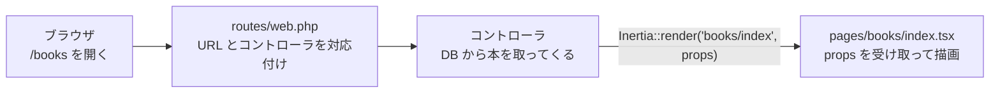

# フロントエンド開発ガイド

このプロジェクトで画面（フロントエンド）を作るためのガイドです。

## 目次

- [はじめに](#はじめに)
- [このアプリの仕組み](#このアプリの仕組み)
- [チュートリアル](#チュートリアル)
    - [ステップ 1 仮ルートを足す](#ステップ-1-仮ルートを足す)
    - [ステップ 2 ページファイルを作る](#ステップ-2-ページファイルを作る)
    - [ステップ 3 見た目を整える](#ステップ-3-見た目を整える)
- [Laravel 側のコードの読み方](#laravel-側のコードの読み方)
- [TypeScript 最小入門](#typescript-最小入門)
- [ページ間の移動](#ページ間の移動)
- [フォーム](#フォーム)
- [共有データとレイアウト](#共有データとレイアウト)
- [UI 部品とスタイリング](#ui-部品とスタイリング)
- [コーディングルールとチェック](#コーディングルールとチェック)
- [よくあるつまずき](#よくあるつまずき)
- [用語集](#用語集)
- [参考リンク](#参考リンク)

## はじめに

このガイドを読み終えると、次のことができるようになります。

- 新しいページを 1 枚作る
- ページ同士をリンクでつなぐ
- フォームを作り、サーバーから返ってきたエラーを表示する
- 既存の UI 部品（ボタン・カード・入力欄など）を使って見た目を整える

**前提** — [開発環境セットアップ](dev-setup.md)が終わっていて、`npm run dev` が起動できる状態であること。

**読み方** — まず「[このアプリの仕組み](#このアプリの仕組み)」を読んでから、「[チュートリアル](#チュートリアル)」で実際にページを作ってみてください。
それ以降の章は、必要になったときに辞書のように引けば十分です。

> [!NOTE]
>
> このガイドのコマンドは、すべてコンテナ内で実行する前提で書いています。
> ホスト（Mac）から実行する場合は、先頭に `sail` を付けてください（例：`npm run dev` → `sail npm run dev`）。
> 詳しくは dev-setup の[アプリを操作する](dev-setup.md#アプリを操作する)を参照してください。

## このアプリの仕組み

### 一般的な React アプリとの違い

このプロジェクトは、Laravel（PHP のフレームワーク）と React を [Inertia](https://inertiajs.com/) でつないだ構成です。
見た目は React で作りますが、作り方はよくある「Vite + React で API を叩くアプリ」とかなり違います。

| やりたいこと           | 一般的な React アプリ                           | このプロジェクト                                    |
| ---------------------- | ----------------------------------------------- | --------------------------------------------------- |
| URL ごとに画面を分ける | React Router（`<Route path="/books">`）         | Laravel の `routes/web.php` に書く                  |
| データを取ってくる     | `useEffect` の中で `fetch('/api/books')`        | **サーバーが props として渡す**。fetch は不要       |
| 別の画面へ移動する     | `<a>` や React Router の `<Link>`               | Inertia の `<Link>`                                 |
| フォームを送信する     | `fetch` で POST して、エラーも自分で `useState` | Inertia の `<Form>`。エラーは自動で `errors` に入る |
| API                    | 自分で作る・叩く                                | **作らない・叩かない**                              |

一番大きな違いは、**「どのページを表示するか」「そのページにどんなデータを渡すか」をサーバー（Laravel）が決める**ことです。
React 側は、受け取った props を画面に描くことに集中できます。

### 画面が表示されるまでの流れ

ブラウザで `/books` を開いたとき、次の順に処理が進みます。



1. **ルート**（URL とそれを処理するプログラムの対応表）から、`/books` を処理するコントローラを探します
2. 見つかった**コントローラ**（リクエストを処理する PHP のクラス）が、データベースから本の一覧を取ってきます
3. コントローラが `Inertia::render('books/index', [...])` を呼ぶと、`resources/js/pages/books/index.tsx` が表示され、渡したデータが **props** として届きます

最初にサイトを開いたときは HTML がまるごと返ってきますが、その後 `<Link>` でページを移動するときは、Inertia が裏で「次のページ名と props」だけを JSON で受け取って画面を差し替えます。
そのため、普通の Web サイトのように画面全体が再読み込みされることはなく、SPA（ページを再読み込みしないアプリ）のように素早く動きます。

### 役割分担

| やること                                                 | 担当                     |
| -------------------------------------------------------- | ------------------------ |
| 画面（React コンポーネント）を作る                       | フロントエンド           |
| 画面を先に作るための**仮ルート**（`Route::inertia`）     | フロントエンド           |
| 本物のルート・コントローラ・データベース・バリデーション | バックエンド             |
| ページに渡す props の**名前と形**を決める                | **両方で相談して決める** |

## チュートリアル

図書館の「本の一覧」ページを作ります。完成すると、本がカードで並ぶページになります。

始める前に `npm run dev` を起動しておいてください。
また、ページを見るにはログインが必要です。まだアカウントが無ければ <http://localhost:8000/register> から作ってください。

### ステップ 1 仮ルートを足す

**編集するファイル：** `routes/web.php`

本物のルートはバックエンド担当が作りますが、それを待たずに画面を作れるように、ダミーデータを渡す**仮ルート**を足します。
ログインした人だけが見られるページにするため、`Route::middleware(['auth', 'verified'])->group(...)` の中に書きます。

```php
Route::middleware(['auth', 'verified'])->group(function () {
    Route::inertia('dashboard', 'dashboard')->name('dashboard');

    Route::inertia('books', 'books/index', [
        'books' => [
            ['id' => 1, 'title' => '吾輩は猫である', 'author' => '夏目漱石', 'category' => ['id' => 1, 'category_name' => '小説']],
            ['id' => 2, 'title' => '羅生門', 'author' => '芥川龍之介', 'category' => ['id' => 1, 'category_name' => '小説']],
            ['id' => 3, 'title' => '銀河鉄道の夜', 'author' => '宮沢賢治', 'category' => ['id' => 2, 'category_name' => '童話']],
        ],
    ])->name('books.index');
});
```

これで「`/books` を開いたら `pages/books/index.tsx` に `books` という props を渡して表示する」という意味になります。
仮ルートを書くときの注意点は[仮ルートで画面を先に作る](#仮ルートで画面を先に作る)にまとめています。

### ステップ 2 ページファイルを作る

**作るファイル：** `resources/js/pages/books/index.tsx`

```tsx
import { Head } from '@inertiajs/react';

type Book = {
    id: number;
    title: string;
    author: string;
    category: {
        id: number;
        category_name: string;
    };
};

type Props = {
    books: Book[];
};

export default function BooksIndex({ books }: Props) {
    return (
        <>
            <Head title="本の一覧" />

            <ul className="p-4">
                {books.map((book) => (
                    <li key={book.id}>
                        {book.title}（{book.author}）
                    </li>
                ))}
            </ul>
        </>
    );
}
```

ポイント：

- **ファイルの場所が大事です**。ステップ 1 で書いた `'books/index'` と、`pages/` 以下のパス `books/index.tsx` が一致している必要があります（大文字・小文字も区別されます）
- ページは必ず `export default` します
- `<Head title="...">` はブラウザのタブに表示されるタイトルです
- 型の書き方は [TypeScript 最小入門](#typescript-最小入門)を見てください。キーは snake_case（`category_name`）です

**確認：** <http://localhost:8000/books> を開いて、本のタイトルが 3 行表示されれば成功です。

### ステップ 3 見た目を整える

最後に、既存の UI 部品 `Card` と `Badge` を使って、本をカードで並べます。完成形は次のとおりです。

```tsx
import { Head } from '@inertiajs/react';
import { Badge } from '@/components/ui/badge';
import { Card, CardContent, CardHeader, CardTitle } from '@/components/ui/card';

type Book = {
    id: number;
    title: string;
    author: string;
    category: {
        id: number;
        category_name: string;
    };
};

type Props = {
    books: Book[];
};

export default function BooksIndex({ books }: Props) {
    return (
        <>
            <Head title="本の一覧" />

            <div className="grid gap-4 p-4 md:grid-cols-3">
                {books.map((book) => (
                    <Card key={book.id}>
                        <CardHeader>
                            <CardTitle>{book.title}</CardTitle>
                        </CardHeader>
                        <CardContent className="flex items-center justify-between">
                            <span className="text-muted-foreground text-sm">
                                {book.author}
                            </span>
                            <Badge variant="secondary">
                                {book.category.category_name}
                            </Badge>
                        </CardContent>
                    </Card>
                ))}
            </div>
        </>
    );
}
```

`md:grid-cols-3` は「画面幅が md（768px）以上なら 3 列」という意味の Tailwind のクラスです（→ [UI 部品とスタイリング](#ui-部品とスタイリング)）。

**確認：** 本がカードで並び、ブラウザの幅を狭めると 1 列になれば完成です。

最後に `npm run check:fix` と `npm run types:check` を実行してエラーが無いことを確認します（→ [コーディングルールとチェック](#コーディングルールとチェック)）。

## Laravel 側のコードの読み方

PHP を書けるようになる必要はありません。**「このページにはどんな props が届くのか」を読み取れれば十分**です。

### PHP を読むための最小知識

| PHP                   | JavaScript で言うと                      |
| --------------------- | ---------------------------------------- |
| `$user`               | 変数 `user`（PHP の変数は `$` で始まる） |
| `['name' => 'Alice']` | オブジェクト `{ name: 'Alice' }`         |
| `[1, 2, 3]`           | 配列 `[1, 2, 3]`                         |
| `$user->name`         | `user.name`                              |
| `Route::get(...)`     | `Route.get(...)`（クラスの関数を呼ぶ）   |

### ルートを読む

ルートは `routes/web.php` と `routes/settings.php` に書かれています。実物を見てみましょう（コメントは説明のために追加しています）。

```php
// routes/web.php

// URL「/」を開いたら pages/welcome.tsx を表示する。このルートの名前は "home"
Route::inertia('/', 'welcome')->name('home');

// この中に書いたルートは、ログインしている人だけが見られる
Route::middleware(['auth', 'verified'])->group(function () {
    // URL「/dashboard」を開いたら pages/dashboard.tsx を表示する
    Route::inertia('dashboard', 'dashboard')->name('dashboard');
});
```

```php
// routes/settings.php（抜粋）

// GET /settings/profile は ProfileController の edit という関数が処理する
Route::get('settings/profile', [ProfileController::class, 'edit'])->name('profile.edit');

// PATCH /settings/profile（フォームの送信先）は ProfileController の update が処理する
Route::patch('settings/profile', [ProfileController::class, 'update'])->name('profile.update');
```

| 書き方                                      | 意味                                                                                                    |
| ------------------------------------------- | ------------------------------------------------------------------------------------------------------- |
| `Route::inertia(URL, ページ名)`             | コントローラを通さず、そのままページを表示する                                                          |
| `Route::get(URL, [コントローラ, '関数名'])` | その URL を GET で開いたら、コントローラの関数が処理する。`post` `patch` `put` `delete` も同様          |
| `->name('profile.edit')`                    | **ルート名**。フロントからリンクするときにこの名前を使う（→ [ページ間の移動](#ページ間の移動)）         |
| `Route::middleware(['auth'])->group(...)`   | **ミドルウェア**（ルートの手前で動くチェック）。`auth` は「ログインしていなければログイン画面へ飛ばす」 |

どんなルートがあるかは、次のコマンドで一覧できます。

```bash
php artisan route:list --path=settings   # URL に settings を含むルートだけ表示
```

```
GET|HEAD  settings/appearance .... appearance.edit › Inertia\Controller › Controller
GET|HEAD  settings/profile ....... profile.edit › Settings\ProfileController@edit
PATCH     settings/profile ....... profile.update › Settings\ProfileController@update
...
```

### コントローラを読む

コントローラは `app/Http/Controllers/` にあります。プロフィール設定画面を表示する部分を見てみます。

```php
// app/Http/Controllers/Settings/ProfileController.php（抜粋）

public function edit(Request $request): Response
{
    return Inertia::render('settings/profile', [                     // ← pages/settings/profile.tsx を表示
        'mustVerifyEmail' => $request->user() instanceof MustVerifyEmail, // ← props.mustVerifyEmail になる
        'status' => $request->session()->get('status'),                   // ← props.status になる
    ]);
}
```

対応は次のとおりです。

- **`Inertia::render` の第 1 引数** = `resources/js/pages/` 以下のファイルパス（拡張子なし）
- **第 2 引数の配列** = ページに届く props

React 側では、これをそのまま引数として受け取ります。

```tsx
// resources/js/pages/settings/profile.tsx（抜粋）
export default function Profile({
    mustVerifyEmail,
    status,
}: {
    mustVerifyEmail: boolean;
    status?: string;
}) {
```

### フォーム送信後にサーバーで起きること

同じコントローラの `update` は、プロフィール編集フォームの送信先です。

```php
public function update(ProfileUpdateRequest $request): RedirectResponse
//                     ↑ ここで入力値のチェック（バリデーション）が行われる。
//                       失敗したらこの関数の中身は実行されず、エラーと一緒に元のページへ戻る
{
    $request->user()->fill($request->validated());
    // ...
    $request->user()->save();                    // データベースに保存

    Inertia::flash('toast', ['type' => 'success', 'message' => __('Profile updated.')]);
    //  ↑ 画面の右下に「保存しました」のような通知（トースト）を出す

    return to_route('profile.edit');             // ルート名 profile.edit のページへ移動する
}
```

フロント側で覚えておくことは次の 2 つです。

- バリデーションに失敗すると、エラーメッセージが自動で `errors` に入って返ってくる（→ [フォーム](#フォーム)）
- `Inertia::flash('toast', ...)` のトーストは自動で表示される。フロント側でコードを書く必要はありません（`resources/js/hooks/use-flash-toast.ts` が処理しています）

バリデーションのルールは `app/Http/Requests/` のファイルに書かれています。

### 全ページ共通の props

`app/Http/Middleware/HandleInertiaRequests.php` の `share()` に書かれたデータは、**すべてのページ**に props として届きます。

```php
public function share(Request $request): array
{
    return [
        ...parent::share($request),
        'name' => config('app.name'),      // アプリ名
        'auth' => [
            'user' => $request->user(),    // ログイン中のユーザー（ログインしていなければ null）
        ],
        'sidebarOpen' => ...,              // サイドバーが開いているか
    ];
}
```

使い方は[共有データとレイアウト](#共有データとレイアウト)で説明します。

### 仮ルートで画面を先に作る

バックエンドができあがるのを待たずに画面を作りたいときは、`Route::inertia` の**第 3 引数にダミーデータ**を書いて仮ルートを作ります。
書き方はチュートリアルの[ステップ 1](#ステップ-1-仮ルートを足す)を見てください。

> [!WARNING]
>
> ログインが必要な画面の仮ルートは、必ず `Route::middleware(['auth', 'verified'])->group(...)` の中に書いてください。
> 外に書くと、ログインしていない人にも見えてしまいます。そのうえ `auth.user` が `null` になるので、
> ページの中で `auth.user.name` などを使っていると画面が真っ白になります。

> [!IMPORTANT]
>
> あとでバックエンド担当が仮ルートを本物のコントローラに置き換えても、props の名前と形が同じなら、ページ側のコードは 1 行も変えずに済みます。
> そのため、props の形（どんな名前で、どんな型のデータが来るか）はフロントとバックエンドの取り決めになります。
> 画面を作り始める前にバックエンド担当と決めておき、PR の説明にも「仮ルートあり」と書いておきましょう。

### キーの名前は snake_case

Laravel からデータベースのデータを送ると、キーの名前は `email_verified_at` のような **snake_case**（単語を `_` でつなぐ書き方）になります。
JavaScript でよく見る `emailVerifiedAt`（camelCase）には自動で変換されません。
TypeScript の型もそのまま snake_case で書いてください（例：`resources/js/types/auth.ts` の `User` 型）。

## TypeScript 最小入門

このプロジェクトは JavaScript ではなく **TypeScript**（JavaScript に「型」を付けたもの）で書きます。
型を書いておくと、props の名前を打ち間違えたり、`null` かもしれない値をそのまま使ったりしたときに、実行する前にエディタが赤い波線で教えてくれます。

### 型の書き方

型は `type 名前 = { ... }` で定義します。

```ts
type Book = {
    id: number; // 数値
    title: string; // 文字列
    is_available: boolean; // true か false
    published_at: string | null; // 文字列か null のどちらか
    note?: string; // ? を付けると「無くてもよい」
    status: 'available' | 'reserved'; // この 2 つの文字列のどちらか
};

type Props = {
    books: Book[]; // Book の配列
};
```

### props に型を付ける

ページやコンポーネントの引数に、この型を付けます。

```tsx
type Props = {
    books: Book[];
};

export default function BooksIndex({ books }: Props) {
    // ...
}
```

`{ books }: Props` の `{ books }` は分割代入です。`props.books` と書く代わりに、最初から `books` という変数で受け取っています。

### このプロジェクトでの決まり

- `interface` ではなく `type` を使います（既存コードに合わせるため）
- 1 つのページでしか使わない型は、そのページのファイルの中に書きます
- 複数のファイルで使う型は `resources/js/types/` に置き、`types/index.ts` から export します。
  使う側は `import type { User } from '@/types';` のように `import type` で読み込みます

```ts
// resources/js/types/auth.ts（既存）
export type User = {
    id: number;
    name: string;
    email: string;
    avatar?: string;
    email_verified_at: string | null;
    created_at: string;
    updated_at: string;
    [key: string]: unknown;
};
```

> [!NOTE]
>
> サーバーから届く props の型は、あくまで「こういうデータが来るはず」という自己申告です。
> サーバーが実際に違う形のデータを送ってきても、TypeScript はそれを検出できません。

### 型エラーの読み方

| エラーメッセージ                                                        | 意味                                      | 直し方                                                           |
| ----------------------------------------------------------------------- | ----------------------------------------- | ---------------------------------------------------------------- |
| `Property 'titel' does not exist on type 'Book'. Did you mean 'title'?` | `Book` 型に `titel` はない（打ち間違い）  | 綴りを直す                                                       |
| `'book.published_at' is possibly 'null'.`                               | `null` かもしれない値をそのまま使っている | `book.published_at ?? '未定'` のように `null` のときの値を決める |
| `Type 'string' is not assignable to type 'number'.`                     | 数値が入るべき所に文字列を渡している      | 渡す値か型定義のどちらが正しいか確認する                         |
| `Binding element 'books' implicitly has an 'any' type.`                 | 引数に型が付いていない                    | `({ books }: Props)` のように型を付ける                          |

プロジェクト全体の型チェックは次のコマンドで実行できます。

```bash
npm run types:check
```

> [!TIP]
>
> エディタで型エラーを表示するには、[DevContainer](dev-setup.md#devcontainer-を使う場合)でプロジェクトを開くのが一番簡単です。

## ページ間の移動

### `<a>` ではなく `<Link>` を使う

```tsx
import { Link } from '@inertiajs/react';
import { index } from '@/routes/books';

// ❌ 画面全体が再読み込みされる（遅いうえ、入力中の内容なども消える）
<a href="/books">本の一覧</a>

// ❌ 再読み込みはされないが、URL を直接書いている
<Link href="/books">本の一覧</Link>

// ✅
<Link href={index()}>本の一覧</Link>
```

### URL を直接書かない（Wayfinder）

URL を文字列で直接書くと、あとで URL が変わったときにリンク切れに気づけません。
このプロジェクトでは [Wayfinder](https://github.com/laravel/wayfinder) が、**PHP のルート定義から TypeScript の関数を自動生成**します。
ルートが変わったり消えたりすると、TypeScript がエラーで教えてくれます。

**ルート名と import の対応**

| ルート定義（PHP）                               | import                                     | 使い方        | URL                 |
| ----------------------------------------------- | ------------------------------------------ | ------------- | ------------------- |
| `->name('dashboard')`                           | `import { dashboard } from '@/routes';`    | `dashboard()` | `/dashboard`        |
| `->name('books.index')`                         | `import { index } from '@/routes/books';`  | `index()`     | `/books`            |
| `->name('books.show')`（URL は `books/{book}`） | `import { show } from '@/routes/books';`   | `show(1)`     | `/books/1`          |
| `->name('profile.edit')`                        | `import { edit } from '@/routes/profile';` | `edit()`      | `/settings/profile` |

ルート名の最後の部分が関数名、それより前が import 元のパスになります。

**よく使う書き方**

```tsx
show(1); // /books/1  （URL の {book} 部分に 1 が入る）
show({ book: 1 }); // 同じ意味
index({ query: { page: 2 } }); // /books?page=2
index.url(); // '/books'（文字列が欲しいとき）
```

関数名がぶつかるときは、`import { edit as editAppearance } from '@/routes/appearance';` のように別名を付けます（例：`resources/js/layouts/settings/layout.tsx`）。

コントローラの関数を直接指定することもできます。フォームの送信先を指定するときによく使います（→ [フォーム](#フォーム)）。

```tsx
// app/Http/Controllers/Settings/ProfileController.php の update
import ProfileController from '@/actions/App/Http/Controllers/Settings/ProfileController';

ProfileController.update(); // { url: '/settings/profile', method: 'patch' }
```

> [!NOTE]
>
> Wayfinder が生成するファイル（`resources/js/routes/` `resources/js/actions/` `resources/js/wayfinder/`）は編集しないでください。Git の管理対象外です。
> `npm run dev` の実行中は、`routes/*.php` を保存するたびに自動で作り直されます。

### `<Link>` の便利な使い方

```tsx
// マウスを乗せた時点で次のページを先読みする（クリック後の表示が速くなる）
<Link href={index()} prefetch>本の一覧</Link>

// ボタンとして表示する（ログアウトなど、GET 以外のリクエストを送るとき）
// import { logout } from '@/routes';
<Link href={logout()} as="button">ログアウト</Link>
```

Wayfinder の関数は URL と HTTP メソッド（`post` など）の両方を持っているので、`method` を別に書く必要はありません（例：`resources/js/components/user-menu-content.tsx` のログアウト）。

### JavaScript から移動する

ボタンを押した後の処理の中などで移動したいときは `router.visit` を使います。

```tsx
import { router } from '@inertiajs/react';
import { show } from '@/routes/books';

router.visit(show(book.id));
```

### 今いるページを判定する

「今このページを開いているか」でスタイルを変えたいときは、既存の `useCurrentUrl`（`resources/js/hooks/use-current-url.ts`）を使います。

```tsx
import { useCurrentUrl } from '@/hooks/use-current-url';

const { isCurrentUrl } = useCurrentUrl();
isCurrentUrl(index()); // 今 /books を開いていれば true
```

## フォーム

### よくある書き方との違い

React のフォームは、次のように `useState` で入力値を持ち、`fetch` で送信する書き方がよく紹介されています。

```tsx
// ❌ このプロジェクトでは使わない書き方
const [facilityId, setFacilityId] = useState('');
const [errors, setErrors] = useState({});

async function handleSubmit(e) {
    e.preventDefault();
    const res = await fetch('/reservations', {
        method: 'POST',
        body: JSON.stringify({ book_id: bookId, facility_id: facilityId }),
    });
    // エラーの受け取り、画面の更新、送信中の表示…を全部自分で書く
}
```

このプロジェクトでは、Inertia の **`<Form>` コンポーネント**を使います。
送信、送信中の状態、エラーの受け取り、送信後の画面更新をすべて Inertia が行います。
自分で `fetch` すると、Laravel のセキュリティチェック（CSRF 対策）に引っかかって `419` エラーになるので、使わないでください。

### 図書館の例：予約フォーム

バックエンド担当が「本を予約する」処理（`ReservationController` の `store`、URL は `POST /reservations`）を作った後の例です。
予約する本（`book_id`）と受け取り館（`facility_id`）を送るフォームを、コンポーネント `resources/js/components/reservation-form.tsx` として作ります。
受け取り館の一覧（`facilities`）は、このフォームを置くページの props としてサーバーから受け取る想定です。

```tsx
import { Form } from '@inertiajs/react';
import { store } from '@/actions/App/Http/Controllers/ReservationController';
import InputError from '@/components/input-error';
import { Button } from '@/components/ui/button';
import { Label } from '@/components/ui/label';
import {
    Select,
    SelectContent,
    SelectItem,
    SelectTrigger,
    SelectValue,
} from '@/components/ui/select';
import { Spinner } from '@/components/ui/spinner';

type Facility = {
    id: number;
    facility_name: string;
};

type Props = {
    bookId: number;
    facilities: Facility[];
};

export default function ReservationForm({ bookId, facilities }: Props) {
    return (
        <Form
            {...store.form()}
            options={{ preserveScroll: true }}
            className="max-w-md space-y-6"
        >
            {({ processing, errors }) => (
                <>
                    <input type="hidden" name="book_id" value={bookId} />

                    <div className="grid gap-2">
                        <Label htmlFor="facility_id">受け取り館</Label>
                        <Select name="facility_id">
                            <SelectTrigger id="facility_id" className="w-full">
                                <SelectValue placeholder="選んでください" />
                            </SelectTrigger>
                            <SelectContent>
                                {facilities.map((facility) => (
                                    <SelectItem
                                        key={facility.id}
                                        value={String(facility.id)}
                                    >
                                        {facility.facility_name}
                                    </SelectItem>
                                ))}
                            </SelectContent>
                        </Select>
                        <InputError message={errors.facility_id} />
                    </div>

                    <Button type="submit" disabled={processing}>
                        {processing && <Spinner />}
                        予約する
                    </Button>
                </>
            )}
        </Form>
    );
}
```

| 部分                                       | 意味                                                                                                            |
| ------------------------------------------ | --------------------------------------------------------------------------------------------------------------- |
| `{...store.form()}`                        | 送信先の URL と HTTP メソッドを Wayfinder から設定する（`POST /reservations`）                                  |
| `options={{ preserveScroll: true }}`       | 送信後にページの一番上までスクロールが戻らないようにする                                                        |
| `{({ processing, errors }) => ( ... )}`    | フォームの中身を関数で書く。`processing` と `errors` を受け取れる                                               |
| `<input type="hidden" name="book_id" ...>` | 画面には表示せずに送る値。どの本の予約かをサーバーに伝える                                                      |
| `<Select name="facility_id">`              | **`name` が送信されるデータのキー**。サーバー側のバリデーションのキーと一致させる                               |
| `value={String(facility.id)}`              | `SelectItem` の `value` は文字列で渡す。サーバーには `"1"` のような文字列で届くが、Laravel 側で数値として扱える |
| `errors.facility_id`                       | サーバーから返ってきた `facility_id` のエラーメッセージ。エラーが無ければ `undefined`                           |
| `<InputError message={...} />`             | エラーメッセージを赤字で表示する既存コンポーネント。`message` が無ければ何も表示しない                          |
| `disabled={processing}`                    | 送信中はボタンを押せなくする（二重送信の防止）                                                                  |
| `{processing && <Spinner />}`              | 送信中だけくるくる回るアイコンを表示する                                                                        |

編集フォームのように最初から値を入れておきたいときは、`defaultValue={...}` を使います。`value` + `onChange` + `useState` を書く必要はありません（例：`resources/js/pages/settings/profile.tsx`）。
送信に成功した後に同じページに残り、入力欄を空に戻したいときは、`<Form>` に `resetOnSuccess` を付けます。

成功したときの「予約しました」のトーストは、バックエンドが `Inertia::flash('toast', ...)` で出すので、フロントでは何も書きません。

> [!IMPORTANT]
>
> `name` 属性がサーバー側のキーと一致していないと、エラーが表示されません。
> 例えばサーバーが `facility_id` のエラーを返しているのに、入力欄が `name="facilityId"` だと、`errors.facilityId` は空のままです。
> キーの名前はバックエンド担当に確認してください。

`<Form>` で足りないくらい細かく制御したい場合は `useForm` という書き方もあります。必要になったら[公式ドキュメント](https://inertiajs.com/docs/v3/the-basics/forms)を見てください。

## 共有データとレイアウト

### ログイン中のユーザーを取得する

[全ページ共通の props](#全ページ共通の-props)は `usePage()` で取り出せます。どのコンポーネントからでも使えます。

```tsx
import { usePage } from '@inertiajs/react';

export function Greeting() {
    const { auth } = usePage().props;

    return <p>こんにちは、{auth.user.name} さん</p>;
}
```

共通の props の型は `resources/js/types/global.d.ts` で定義済みなので、自分で型を書く必要はありません。

### レイアウトはフォルダーで決まる

**レイアウト**（サイドバーやヘッダーなど、ページの外側の枠）は、各ページで書くのではなく `resources/js/app.tsx` でまとめて決めています。

```tsx
// resources/js/app.tsx（抜粋）
layout: (name) => {
    switch (true) {
        case name === 'welcome':
            return null;
        case name.startsWith('auth/'):
            return AuthLayout;
        case name.startsWith('settings/'):
            return [AppLayout, SettingsLayout];
        default:
            return AppLayout;
    }
},
```

| ページの場所                         | レイアウト                             |
| ------------------------------------ | -------------------------------------- |
| `pages/welcome.tsx`                  | なし                                   |
| `pages/auth/*`（ログイン・登録など） | `AuthLayout`（中央にカードがある画面） |
| `pages/settings/*`                   | `AppLayout` の中に `SettingsLayout`    |
| それ以外（`pages/books/*` など）     | `AppLayout`（サイドバー付きの画面）    |

新しいレイアウトの作り方は[レイアウトを作る](#レイアウトを作る)を見てください。

### ページからレイアウトに値を渡す

ページの関数に `.layout = { ... }` を付けると、その値がレイアウトに渡されます。

```tsx
// AuthLayout にタイトルと説明文を渡す（pages/auth/login.tsx）
Login.layout = {
    title: 'Log in to your account',
    description: 'Enter your email and password below to log in',
};
```

本のタイトルなど、props の値を使ってレイアウトを変えたいときは `setLayoutProps` という関数を使います。詳しくは[公式ドキュメント](https://inertiajs.com/docs/v3/the-basics/layouts#layout-props)を見てください。

### レイアウトを作る

図書館の画面用に、ヘッダーとナビゲーションを持つレイアウト `LibraryLayout` を作り、`pages/books/*` のページに使う例です。

**1. レイアウトのファイルを作る**

**作るファイル：** `resources/js/layouts/library-layout.tsx`

```tsx
import { Link, usePage } from '@inertiajs/react';
import type { ReactNode } from 'react';
import { useCurrentUrl } from '@/hooks/use-current-url';
import { cn } from '@/lib/utils';
import { dashboard } from '@/routes';
import { index as booksIndex } from '@/routes/books';

const navItems = [
    { title: 'ダッシュボード', href: dashboard() },
    { title: '本の一覧', href: booksIndex() },
];

type Props = {
    title?: string;
    children: ReactNode;
};

export default function LibraryLayout({ title = '', children }: Props) {
    const { auth } = usePage().props;
    const { isCurrentUrl } = useCurrentUrl();

    return (
        <div className="min-h-svh">
            <header className="flex items-center justify-between border-b px-6 py-4">
                <nav className="flex gap-4">
                    {navItems.map((item) => (
                        <Link
                            key={item.title}
                            href={item.href}
                            className={cn(
                                'text-sm',
                                isCurrentUrl(item.href) && 'font-bold',
                            )}
                        >
                            {item.title}
                        </Link>
                    ))}
                </nav>
                <span className="text-muted-foreground text-sm">
                    {auth.user.name}
                </span>
            </header>

            <main className="p-6">
                {title && <h1 className="mb-4 text-xl font-medium">{title}</h1>}
                {children}
            </main>
        </div>
    );
}
```

ポイント：

- レイアウトもただの React コンポーネントです。`export default` し、**`children` を必ず受け取って表示します**。ここにページの中身が入ります
- `title` のように、ページから受け取りたい値は props として定義します。ページが渡さなかったときのために、`title = ''` のように初期値を決めておきます
- ログイン中のユーザーなど全ページ共通のデータは、レイアウトの中でも `usePage()` で取り出せます

**2. `app.tsx` に登録する**

**編集するファイル：** `resources/js/app.tsx`

```tsx
import LibraryLayout from '@/layouts/library-layout'; // 追加

// ...
layout: (name) => {
    switch (true) {
        case name === 'welcome':
            return null;
        case name.startsWith('auth/'):
            return AuthLayout;
        case name.startsWith('settings/'):
            return [AppLayout, SettingsLayout];
        case name.startsWith('books/'): // 追加
            return LibraryLayout;
        default:
            return AppLayout;
    }
},
```

`switch (true)` は上から順に調べて、最初に当てはまった `case` のレイアウトを使います。
すべてのページのレイアウトを差し替えたいときは、`default` の `AppLayout` を書き換えます。

**3. ページから値を渡す**

[ページからレイアウトに値を渡す](#ページからレイアウトに値を渡す)と同じ書き方で、レイアウトの props に値を渡せます。

```tsx
// resources/js/pages/books/index.tsx の一番下
BooksIndex.layout = {
    title: '本の一覧',
};
```

**確認：** <http://localhost:8000/books> を開いて、上部にナビゲーションと「本の一覧」の見出しが表示されれば成功です。

> [!NOTE]
>
> 同じレイアウトを使うページ同士を `<Link>` で移動しても、レイアウトは作り直されず、ページの部分だけが入れ替わります。
> そのため、レイアウトの中の `useState`（メニューの開閉など）やスクロール位置は、ページを移動しても保たれます。
> 逆に、ページごとに変わる値をレイアウトの `useState` に入れると、前のページの値が残ってしまうので、props で受け取ってください。

レイアウトの中にレイアウトを入れる（`settings/*` の `[AppLayout, SettingsLayout]` のような）書き方など、詳しくは[公式ドキュメント](https://inertiajs.com/docs/v3/the-basics/layouts)を見てください。

## UI 部品とスタイリング

デザインは [README](../README.md) の Figma を見てください。

### まず `components/ui/` を探す

ボタンや入力欄などの基本的な部品は、**自分で作る前に `resources/js/components/ui/` を探してください**。
これらは [shadcn/ui](https://ui.shadcn.com/docs/components) という部品集から取り込んだもので、使い方は shadcn/ui の公式ページにそのまま載っています。

| 部品                       | ファイル                 | 用途                               |
| -------------------------- | ------------------------ | ---------------------------------- |
| `Button`                   | `button.tsx`             | ボタン                             |
| `Input` / `Label`          | `input.tsx` ほか         | 入力欄とそのラベル                 |
| `Checkbox` / `Select`      | `checkbox.tsx` ほか      | チェックボックス、セレクトボックス |
| `Card` 系                  | `card.tsx`               | カード（枠付きの箱）               |
| `Badge`                    | `badge.tsx`              | 「貸出中」のような小さなラベル     |
| `Alert`                    | `alert.tsx`              | 注意書きの枠                       |
| `Dialog` / `Sheet`         | `dialog.tsx` ほか        | モーダル、横から出てくるパネル     |
| `DropdownMenu` / `Tooltip` | `dropdown-menu.tsx` ほか | メニュー、マウスを乗せたときの説明 |
| `Skeleton` / `Spinner`     | `skeleton.tsx` ほか      | 読み込み中の表示                   |
| `Separator`                | `separator.tsx`          | 区切り線                           |

`Button` には見た目の種類（`variant`）があります。

```tsx
import { Button } from '@/components/ui/button';

// 通常
<Button>予約する</Button>

// 枠線だけ
<Button variant="outline">キャンセル</Button>

// 削除など、取り消せない操作
<Button variant="destructive">予約を取り消す</Button>
```

`variant` には `default` `destructive` `outline` `secondary` `ghost` `link` があります。

> [!WARNING]
>
> `components/ui/` のファイルは直接編集しないでください。見た目を変えたいときは、使う側で `className` を渡します。
> 新しい shadcn/ui の部品が必要なときは `npx shadcn@latest add 部品名` で追加できますが、
> 依存パッケージが増えることがあるので、追加する前に相談してください。

このプロジェクト独自の部品は `resources/js/components/` にあります。

| 部品            | 用途                                         |
| --------------- | -------------------------------------------- |
| `Heading`       | ページや区切りの見出し（タイトル＋説明文）   |
| `InputError`    | 入力欄の下のエラーメッセージ                 |
| `TextLink`      | 文中のリンク                                 |
| `PasswordInput` | 表示・非表示を切り替えられるパスワード入力欄 |

自分で部品を作るときも `resources/js/components/` に置きます。ファイル名は `book-card.tsx` のように **kebab-case**（単語を `-` でつなぐ）です。

### Tailwind CSS でスタイルを付ける

スタイルは CSS ファイルを書くのではなく、[Tailwind CSS](https://tailwindcss.com/docs) の**クラス**で付けます。

```tsx
<div className="flex items-center gap-4 rounded-lg border p-4">
```

| クラス                    | 意味                                    |
| ------------------------- | --------------------------------------- |
| `flex` / `grid`           | Flexbox / Grid で並べる                 |
| `gap-4` / `p-4` / `mt-2`  | 間隔・内側の余白・上の外側の余白        |
| `text-sm` / `font-medium` | 文字の大きさ・太さ                      |
| `rounded-lg` / `border`   | 角丸・枠線                              |
| `md:grid-cols-3`          | 画面幅が md（768px）以上のときだけ 3 列 |

**色はテーマの色を優先して使ってください。**

| クラス                              | 用途                   |
| ----------------------------------- | ---------------------- |
| `bg-background` / `text-foreground` | 基本の背景色・文字色   |
| `text-muted-foreground`             | 補足説明などの薄い文字 |
| `bg-primary`                        | メインの色             |
| `bg-muted`                          | 薄い背景（選択中など） |
| `text-destructive`                  | 削除・エラーなどの色   |

テーマ色はダークモードで自動的に切り替わります。
`text-red-600` のように**色を直接指定したときだけ**、`dark:text-red-400` のようにダークモード用の色も書いてください（例：`resources/js/components/input-error.tsx`）。

> [!NOTE]
>
> Tailwind v4 では、設定は `resources/css/app.css` の `@theme` の中にあります。`tailwind.config.js` はありません。

### 条件によってクラスを変える

`cn()`（`resources/js/lib/utils.ts`）を使うと、条件付きでクラスを足せます。

```tsx
import { cn } from '@/lib/utils';

<div className={cn('rounded-md p-2', isSelected && 'bg-muted')}>

// オブジェクトでも書ける（resources/js/layouts/settings/layout.tsx）
<Button className={cn('w-full justify-start', { 'bg-muted': isCurrentOrParentUrl(item.href) })}>
```

### アイコン

アイコンは [lucide](https://lucide.dev/icons/) を使います。サイトで探して、名前を import します。

```tsx
import { Library } from 'lucide-react';

export function BooksLabel() {
    return (
        <span className="flex items-center gap-2">
            <Library className="size-4" />
            本の一覧
        </span>
    );
}
```

## コーディングルールとチェック

### 名前の付け方

| 対象             | 書き方                                  | 例                                       |
| ---------------- | --------------------------------------- | ---------------------------------------- |
| ファイル名       | kebab-case                              | `book-card.tsx`、`pages/books/index.tsx` |
| コンポーネント名 | PascalCase                              | `BookCard`、`BooksIndex`                 |
| ページ           | `export default` する                   | `export default function BooksIndex()`   |
| import のパス    | `@/` から書く（`@/` = `resources/js/`） | `import { cn } from '@/lib/utils';`      |

迷ったら、近くにある既存のファイルに合わせてください。

### このプロジェクトの React の注意点

- **データを取るために `useEffect` + `fetch` を書かない** — データは props で受け取ります。足りないデータがあれば、props に追加してもらうようバックエンド担当に相談してください
- **`useMemo` / `useCallback` / `memo` は基本的に不要** — [React Compiler](https://ja.react.dev/learn/react-compiler) が有効になっていて、同じ最適化を自動で行います
- **開発中は `useEffect` が 2 回実行される** — StrictMode という、バグを見つけやすくするための設定が有効なためです。バグではありません
- **コンポーネントの中でいきなり `window` や `localStorage` を使わない** — このプロジェクトでは、最初の表示を速くするためにサーバー上でも React を実行しています（SSR）。サーバーには `window` が無いのでエラーになります。`onClick` などのイベントの中か、`useEffect` の中で使ってください

```tsx
// ❌ サーバーで実行されたときにエラーになる
export default function Example() {
    const saved = localStorage.getItem('draft');
    // ...
}
```

```tsx
// ✅ useEffect の中はブラウザでしか実行されない
export default function Example() {
    useEffect(() => {
        const saved = localStorage.getItem('draft');
        // ...
    }, []);
    // ...
}
```

### PR を出す前に実行するコマンド

```bash
npm run check:fix     # 整形（Tailwind のクラスの並べ替えを含む）と、自動で直せる問題の修正
npm run check         # lint（問題のある書き方の検出）と整形のチェック。ファイルは変更しない
npm run types:check   # 型チェック
```

PR を出すと、GitHub 上でも同じチェックが自動で実行されます。このプロジェクトでは**警告（warning）が 1 つでもあると失敗**します。
`check:fix` で直らなかったものは、メッセージを読んで手で直してください。

PR の出し方は [README のチームルール](../README.md#チームルール)に従ってください。

## よくあるつまずき

### 新しく作ったページで `Unable to locate file in Vite manifest` が出る

```
Unable to locate file in Vite manifest: resources/js/pages/books/index.tsx.
```

`npm run dev` が起動していません。起動してからページを再読み込みしてください。
（`npm run dev` を止めた状態では、以前にビルドしたファイルが使われるため、新しく作ったページが見つかりません。）

### 編集しても画面が変わらない

同じく、`npm run dev` が起動しているか確認してください。起動していれば、ファイルを保存するとすぐに画面に反映されます。

### 画面が真っ白で、ターミナルに `Page not found` と出る

```
Page not found: books/indx
```

`Inertia::render` や `Route::inertia` に書いたページ名と、`resources/js/pages/` 以下のファイルパスが一致していません。
打ち間違いや、大文字・小文字の違いがないか確認してください。

### `Cannot find module '@/routes/books'` と出る

```
Cannot find module '@/routes/books' or its corresponding type declarations.
```

Wayfinder の関数がまだ生成されていません。

1. `npm run dev` が起動しているか確認する（ルートファイルを保存すると自動で生成されます）
2. ルートに `->name('books.index')` のようにルート名が付いているか、`php artisan route:list --path=books` で確認する

### props が `undefined` になる

- サーバー側（コントローラや仮ルート）で、その props を本当に渡しているか確認する
- キーの名前が一致しているか確認する（`categoryName` と `category_name` など。→ [キーの名前は snake_case](#キーの名前は-snake_case)）
- 実際に届いているデータを見る：ブラウザの開発者ツールに [React Developer Tools](https://ja.react.dev/learn/react-developer-tools) を入れると、Components タブでページのコンポーネントを選んで props を確認できます

### リンクをクリックすると画面全体が一瞬白くなる

`<Link>` ではなく `<a>` を使っています。→ [ページ間の移動](#ページ間の移動)

### フォームを送信すると `419` エラーになる

自分で `fetch` を使って送信しています。`<Form>` を使ってください。→ [フォーム](#フォーム)

### `Cannot read properties of null (reading 'name')` と出る

ログインしていない状態で `auth.user.name` を使っています。
そのページの仮ルートが `auth` グループの外に書かれていないか確認してください。→ [仮ルートで画面を先に作る](#仮ルートで画面を先に作る)

## 用語集

| 用語                   | 意味                                                                                           | 関連する章                                                                    |
| ---------------------- | ---------------------------------------------------------------------------------------------- | ----------------------------------------------------------------------------- |
| props                  | 親（このプロジェクトではサーバー）からコンポーネントに渡されるデータ                           | [このアプリの仕組み](#このアプリの仕組み)                                     |
| コンポーネント         | 画面の部品。React では大文字で始まる関数                                                       | [UI 部品とスタイリング](#ui-部品とスタイリング)                               |
| ページ                 | `resources/js/pages/` にある、1 画面ぶんのコンポーネント                                       | [チュートリアル](#チュートリアル)                                             |
| レイアウト             | サイドバーやヘッダーなど、ページの外側の共通の枠                                               | [共有データとレイアウト](#共有データとレイアウト)                             |
| ルート                 | URL と、それを処理するプログラムの対応表                                                       | [Laravel 側のコードの読み方](#laravel-側のコードの読み方)                     |
| ルート名               | ルートに付けた名前（`books.index` など）。リンクを作るときに使う                               | [ページ間の移動](#ページ間の移動)                                             |
| 仮ルート               | バックエンドができる前に、ダミーデータで画面を表示するためのルート                             | [仮ルートで画面を先に作る](#仮ルートで画面を先に作る)                         |
| コントローラ           | リクエストを受け取って処理する PHP のクラス                                                    | [コントローラを読む](#コントローラを読む)                                     |
| ミドルウェア           | ルートの手前で動くチェック（ログインしているか、など）                                         | [ルートを読む](#ルートを読む)                                                 |
| バリデーション         | 送信された入力値が正しいかのチェック                                                           | [フォーム](#フォーム)                                                         |
| フラッシュ             | 次の画面で一度だけ表示するメッセージ                                                           | [フォーム送信後にサーバーで起きること](#フォーム送信後にサーバーで起きること) |
| トースト               | 画面の端に一時的に出る通知                                                                     | [フォーム送信後にサーバーで起きること](#フォーム送信後にサーバーで起きること) |
| Inertia                | Laravel と React をつなぐライブラリ                                                            | [このアプリの仕組み](#このアプリの仕組み)                                     |
| Wayfinder              | PHP のルート定義から、TypeScript の関数を自動生成するツール                                    | [ページ間の移動](#ページ間の移動)                                             |
| shadcn/ui              | ボタンや入力欄などの UI 部品集。`components/ui/` に取り込まれている                            | [UI 部品とスタイリング](#ui-部品とスタイリング)                               |
| Tailwind CSS           | クラス名でスタイルを付ける CSS のフレームワーク                                                | [UI 部品とスタイリング](#ui-部品とスタイリング)                               |
| SPA                    | ページ全体を再読み込みせずに画面を切り替えるアプリ                                             | [このアプリの仕組み](#このアプリの仕組み)                                     |
| SSR                    | 最初の表示を速くするため、サーバー上で React を実行して HTML を作ること                        | [コーディングルールとチェック](#コーディングルールとチェック)                 |
| CSRF 対策              | 他のサイトから勝手にフォームを送信されるのを防ぐ仕組み。自前の `fetch` だと `419` エラーになる | [フォーム](#フォーム)                                                         |
| snake_case / camelCase | `category_name` / `categoryName` のような名前の書き方。Laravel から来るデータは snake_case     | [キーの名前は snake_case](#キーの名前は-snake_case)                           |
| 型・型エラー           | 値の種類（文字列・数値など）の宣言と、それに合わない使い方をしたときのエラー                   | [TypeScript 最小入門](#typescript-最小入門)                                   |
| lint                   | 問題のある書き方を自動で見つけるチェック                                                       | [コーディングルールとチェック](#コーディングルールとチェック)                 |

## 参考リンク

| 内容                             | リンク                                              |
| -------------------------------- | --------------------------------------------------- |
| Inertia（v3）                    | <https://inertiajs.com/docs/v3/>                    |
| React 公式（日本語）             | <https://ja.react.dev/learn>                        |
| TypeScript（日本語の入門書）     | [サバイバル TypeScript](https://typescriptbook.jp/) |
| Tailwind CSS                     | <https://tailwindcss.com/docs>                      |
| shadcn/ui の部品一覧             | <https://ui.shadcn.com/docs/components>             |
| lucide のアイコン一覧            | <https://lucide.dev/icons/>                         |
| Wayfinder                        | <https://github.com/laravel/wayfinder>              |
| Laravel のルーティング           | <https://laravel.com/docs/routing>                  |
| このプロジェクトのフォルダー構成 | [ディレクトリ構成](directory-structure.md)          |
